# 待办事项后端API - 简化版测试报告

- **项目名称**: to_do_list
- **项目版本**: V1.0
- **测试人员**: 李锡浩 杨晓舒
- **测试日期**: 2025年07月01日

---

## 1. 测试简介

本次测试旨在验证“待办事项后端”项目的核心API功能是否正常工作。主要测试对象包括 **任务管理**、**习惯养成** 和 **番茄钟** 三大模块。

- **测试工具**: FastAPI 自动生成的交互式API文档 (`/docs`)
- **测试环境**: 本地开发环境 (`http://127.0.0.1:8000`)

---

## 2. Swagger UI功能测试用例与结果

### 2.1. 任务 (Tasks) 模块测试

| 用例ID | 测试功能 | 测试步骤 | 预期结果 | 实际结果 (截图) | 状态 |
| :--- | :--- | :--- | :--- | :--- | :--- |
| **TC-TASK-001** | **成功创建新任务** | 1. 访问 `/docs` 页面，展开 `POST /tasks` 接口。 2. 点击 "Try it out"。 3. 在请求体中输入:   `{ "name": "学习API测试", "description": "尝试" }` 4. 点击 "Execute"。 | - 服务器返回 `201 Created` 状态码。 - 响应内容中包含刚创建的任务信息，并带有一个唯一的 `id`。 | 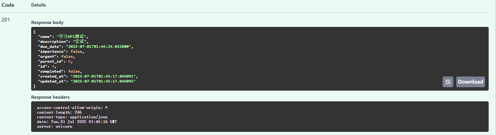 | 通过 |
| **TC-TASK-002** | **创建任务失败 (缺少名称)** |  在请求体中输入一个没有 `name` 字段的JSON:   `{ "description": "没有名称的任务" }`  | - 服务器返回 `422 Unprocessable Entity` 错误状态码。 - 响应内容中提示 `name` 字段是必需的。 | 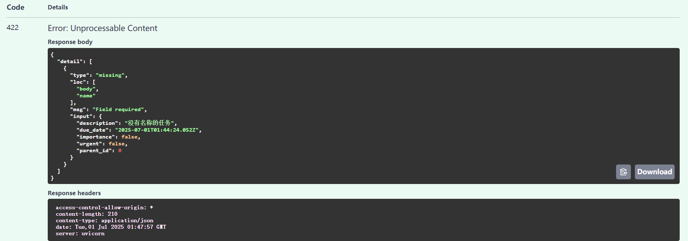 | 通过 |
| **TC-TASK-003** | **获取所有任务列表** | 1. 确保已通过 **TC-TASK-001** 创建了至少一个任务。 2. 点击 "Try it out"，然后点击 "Execute"。 | - 服务器返回 `200 OK` 状态码。 - 响应内容是一个列表（数组），列表中包含了之前创建的任务。 | 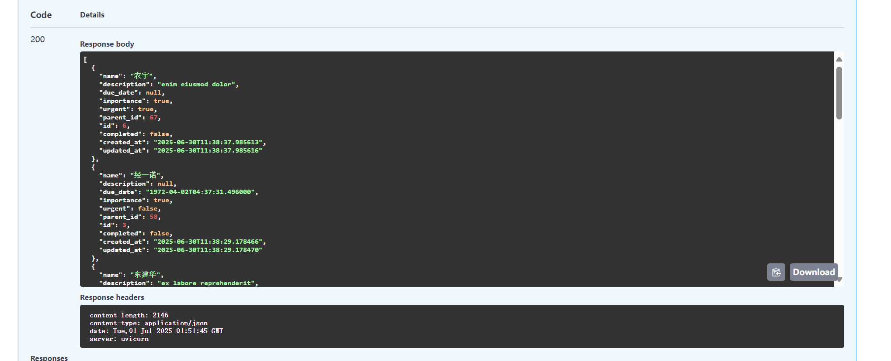 | 通过 |
| **TC-TASK-004** | **更新指定任务** | 1. 记下 **TC-TASK-001** 中创建的任务 `id` (例如 `1`)。 2. 在 `task_id` 处填入 `1`。 3. 在请求体中输入:   `{ "completed": true }` 4. 点击 "Execute"。 | - 服务器返回 `200 OK` 状态码。 - 响应内容中，该任务的 `completed` 字段变为 `true`。 |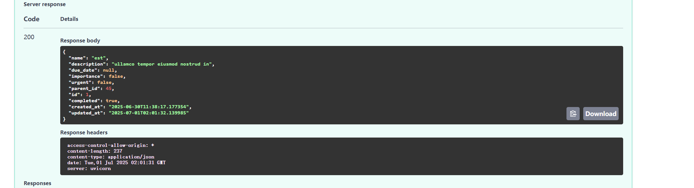 | 通过 |
| **TC-TASK-005** | **删除指定任务** | 1. 在 `task_id` 处填入 `1`。 2. 点击 "Execute"。 | - 服务器返回 `204 No Content` 状态码。 - 此时再次获取任务列表 (**TC-TASK-003**)，该任务已不存在。 | |  通过 |
| **TC-TASK-006** | **搜索指定任务** | 1. 在 `搜索` 处填入 `API`。 2. 点击 "Execute"。 |  - 服务器返回 `200 OK` 状态码。 - 此时再次获取任务列表 (**TC-TASK-003**)，该任务已不存在。 | 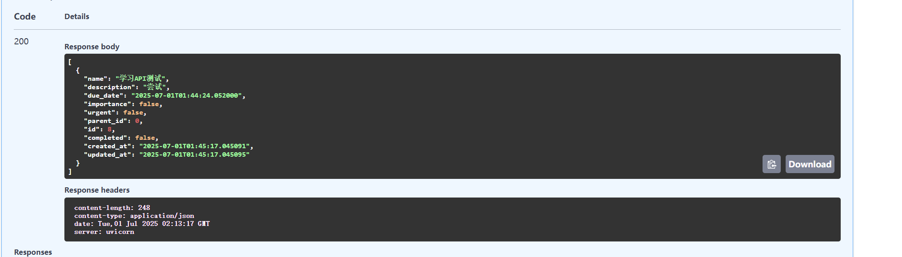|  通过 |
| **TC-TASK-007** | **返回子任务** | 1. 在 `task_id` 处填入 `8`。 2. 点击 "Execute"。 |  - 服务器返回 `200 OK` 状态码。 - 响应内容是一个列表（数组），列表中包含了之前创建的任务。 | 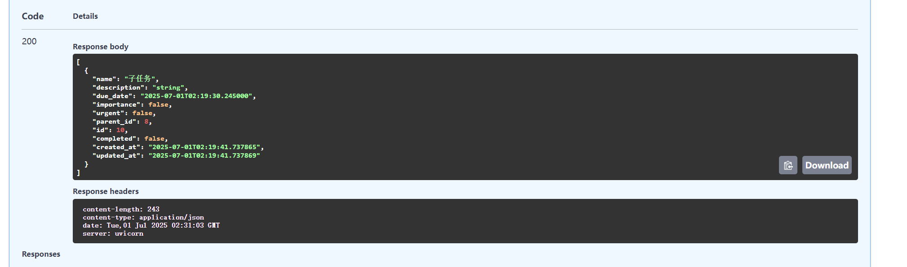|  通过 |

---

### 2.2. 习惯 (Habits) 模块测试

| 用例ID | 测试功能 | 测试步骤 | 预期结果 | 实际结果 (截图) | 状态 |
| :--- | :--- | :--- | :--- | :--- | :--- |
| **TC-HABIT-001** | **成功创建新习惯** | 1. 访问 `/docs` 页面，展开 `POST /habits` 接口。 2. 点击 "Try it out"。 3. 在请求体中输入:   `{ "name": "每天阅读", "description": "每天阅读30分钟" }` 4. 点击 "Execute"。 |  - 服务器返回 `201 Created` 状态码。 - 响应内容中包含刚创建的习惯信息，并带有一个 `id`。 | 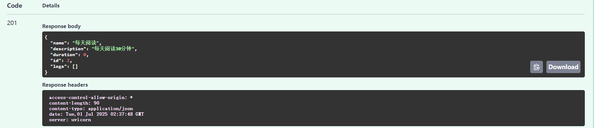 | 通过 |
| **TC-HABIT-002** | **创建重复习惯** | 1. 在请求体中输入:   `{ "name": "每天阅读", "description": "每天阅读30分钟" }` 2. 点击 "Execute"。 |  - 服务器返回 `400 Bad Request` 状态码。 - 响应内容中提示`创建习惯失败: 习惯 '每天阅读' 已存在。` | 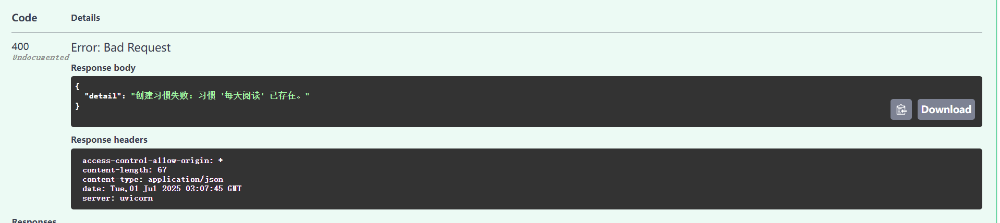| 通过 |
| **TC-HABIT-003** | **获取所有习惯列表** | 1. 确保已通过 **TC-HABIT-001** 创建了至少一个习惯。 2. 点击 "Try it out"，然后点击 "Execute"。 | - 服务器返回 `200 OK` 状态码。 - 响应内容是一个列表，包含了之前创建的习惯。 |  |  通过 |
| **TC-HABIT-004** | **成功为习惯打卡** | 1. 记下 **TC-HABIT-001** 中创建的习惯 `id` (例如 `2`)。 2. 在 `habit_id` 处填入 `3`。 3. 请求体可以为空 `{}` 或 `{"date": "2025-07-01T10:20:00Z"}` 4. 点击 "Execute"。 | - 服务器返回 `201 Created` 状态码。 - 响应内容为 `{"id": 3,"habit_id": 3,"date": "2025-07-01T00:00:00"}`。 - 产生一个打卡日志 | 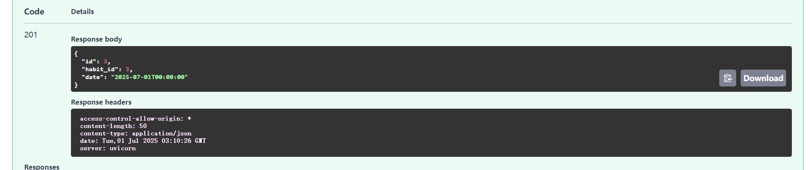 |  通过 |
| **TC-HABIT-005** | **每日只能打卡一次** | 1. 记下 **TC-HABIT-001** 中创建的习惯 `id` (例如 `2`)。 2. 在 `habit_id` 处填入 `2`。 3. 请求体可以为空 `{}` 或 `{"date": "2025-07-01T10:20:00Z"}` 4. 点击 "Execute"。 | - 服务器返回 `409 Conflict` 状态码。 - 响应内容为 `{"detail": "创建打卡记录失败: 今日已打卡，请勿重复操作。"}`。 - 产生一个打卡日志 | 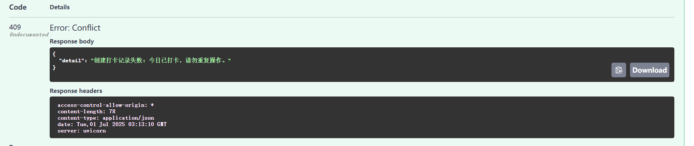 |  通过 |
| **TC-HABIT-006** | **获取打卡记录** | 1. 记下 **TC-HABIT-001** 中创建的习惯 `id` (例如 `2`)。 2. 在 `habit_id` 处填入 `2`。 3. 点击 "Execute"。 | - 服务器返回 `200 OK` 状态码。 - 响应内容为 `{"[{"id": 1,"habit_id": 2,"date": "2025-07-01T00:00:00"}]"}`。 - 产生一个打卡日志 | 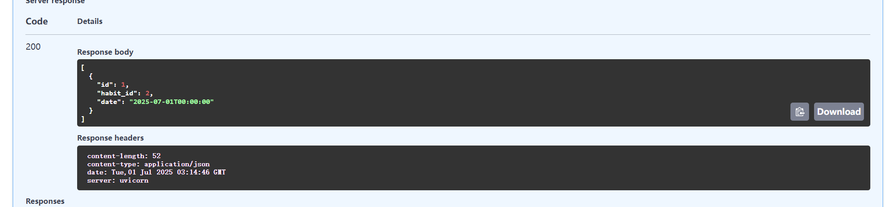 |  通过 |
| **TC-HABIT-007** | **获取当前持续打卡天数** | 1. 记下 **TC-HABIT-001** 中创建的习惯 `id` (例如 `2`)。 2. 在 `habit_id` 处填入 `2`。 3. 点击 "Execute"。 | - 服务器返回 `200 OK` 状态码。 - 响应内容为 `1`。 - 产生一个打卡日志 | 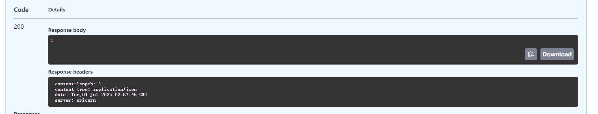 |  通过 |
---

## 3. Apifox 测试

### 3.1. 任务 (Tasks) 模块测试
##### 3.1.1. 测试流程
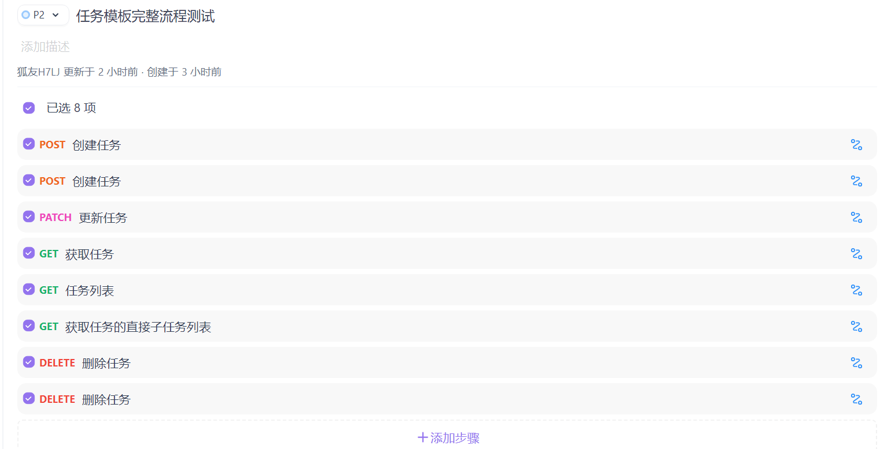
##### 3.1.2.功能测试报告
[点击查看任务功能测试文件HTML格式](./docs/assets/tasks-apifox-reports.html)
##### 3.1.3 性能测试报告
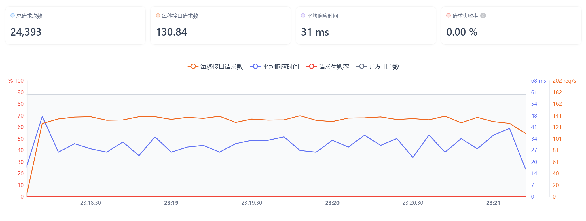
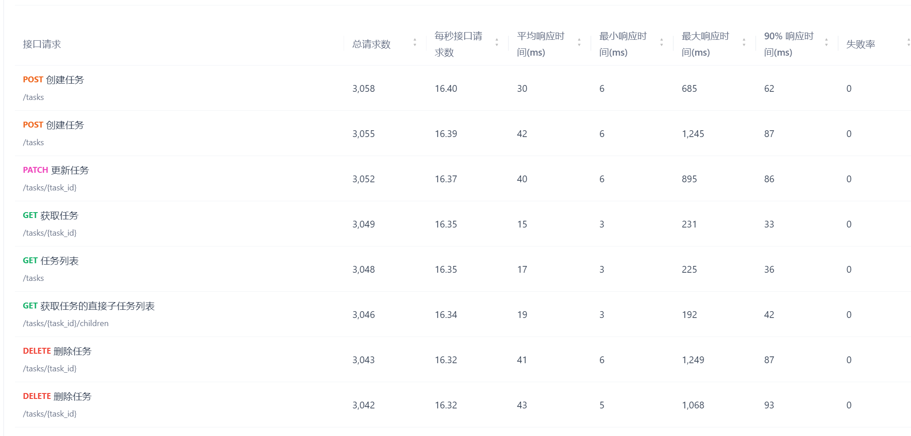
### 3.2. 习惯 (Habits) 模块测试
##### 3.2.1. 测试流程

##### 3.2.2. 功能测试报告
[点击查看习惯功能测试文件HTML格式](./docs/assets/habits-apifox-reports.html)
##### 3.2.3. 性能测试报告
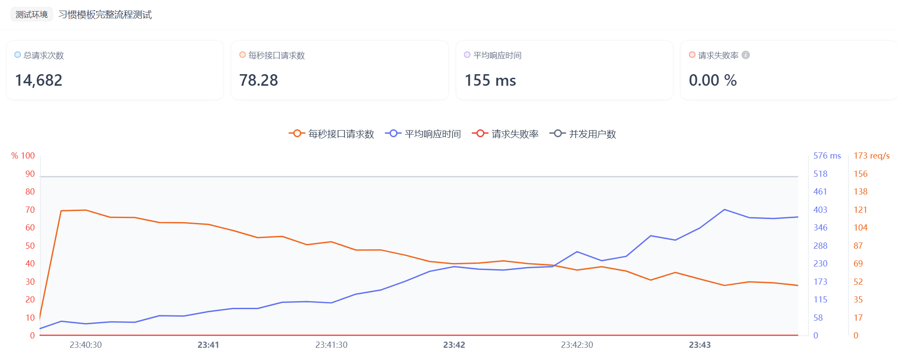
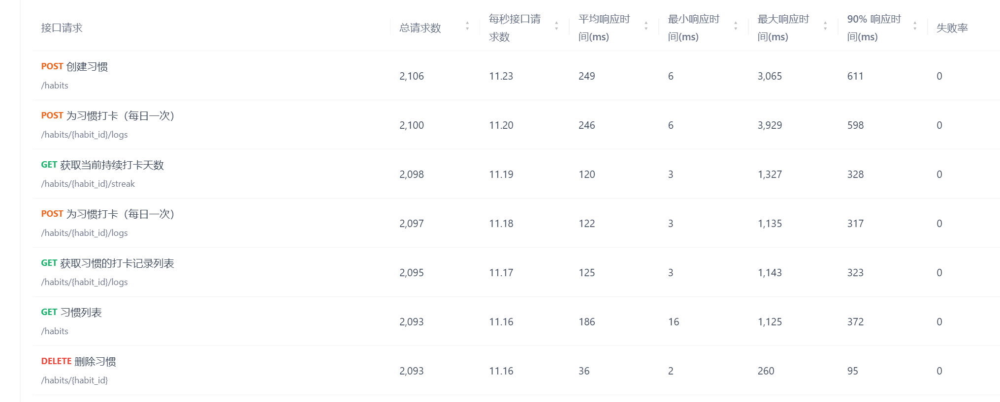

## 4. 测试总结

本次测试覆盖了任务、习惯模块的核心CRUD（创建、读取、更新、删除）功能。

**总体结果**:所有测试用例均已通过，API功能符合预期。

**发现的问题**:
- 决定将番茄钟的功能完全在前端实现，无需在后端存储数据
- task更复杂的情况还未测试
