---
puppeteer:
  printBackground: true  # 必须开启
---

# 技术报告

**目录**

- [To-Do List 需求分析文档](#to-do-list-需求分析文档)
- [Todo-List 概要设计文档](#todo-list-概要设计文档)
- [To-Do List 系统详细设计文档](#to-do-list-系统详细设计文档)
- [Todo-List 接口设计文档](#todo-list-接口设计文档)
- [Git 使用报告 - to\_do\_list](#git-使用报告---to_do_list)
- [测试报告](#待办事项后端api-测试报告)
- [CI/CD 技术文档](#cicd-技术文档)
- [ToDoList 项目总结报告](#todolist-项目总结报告)

---

# To-Do List 需求分析文档

**目录**
- [To-Do List 需求分析文档](#to-do-list-需求分析文档)
  - [📋 项目信息](#-项目信息)
  - [🎯 项目概述](#-项目概述)
    - [项目目标](#项目目标)
  - [🔍 功能需求](#-功能需求)
    - [核心功能(P0 - 必须有)](#核心功能p0---必须有)
    - [重要功能(P1 - 应该有)](#重要功能p1---应该有)
    - [可选功能(P2/P3)](#可选功能p2p3)
  - [📊 非功能性需求](#-非功能性需求)
    - [性能需求](#性能需求)
    - [可用性需求](#可用性需求)
    - [安全性需求](#安全性需求)
    - [兼容性需求](#兼容性需求)
  - [� 数据模型](#-数据模型)
    - [任务表(Tasks)](#任务表tasks)
    - [习惯表(Habits)](#习惯表habits)
  - [🔄 核心业务流程](#-核心业务流程)
    - [任务管理流程](#任务管理流程)
    - [习惯养成流程](#习惯养成流程)
    - [番茄钟工作流程](#番茄钟工作流程)
  - [📋 约束条件](#-约束条件)
    - [技术约束](#技术约束)
    - [业务约束](#业务约束)
    - [时间约束](#时间约束)
  - [✅ 验收标准](#-验收标准)
    - [功能验收](#功能验收)
    - [性能验收](#性能验收)
    - [用户体验验收](#用户体验验收)
  - [📚 附录](#-附录)
    - [功能说明表](#功能说明表)
    - [联系信息](#联系信息)


## 📋 项目信息
- **项目名称**: TodoList 个人效率管理系统
- **版本**: v1.0.0
- **创建日期**: 2025年7月4日

## 🎯 项目概述

### 项目目标
开发一个集任务管理、习惯打卡、番茄钟于一体的个人效率管理系统，帮助用户：
- 提高工作效率和任务管理能力
- 培养良好的生活习惯
- 优化时间管理和专注力
- 通过数据分析改进个人效率


## 🔍 功能需求

### 核心功能(P0 - 必须有)

**任务管理**
- 创建、编辑、删除、完成任务
- 任务包含：名称、描述、截止日期、优先级
- 筛选功能

**智能优先级**
- 基于重要性、紧急性、截止日期自动计算
- 支持手动调整权重
- 按优先级排序显示

### 重要功能(P1 - 应该有)

**层级任务(tkinter前端实现，html并没有)**
- 支持父子任务关系
- 子任务完成影响父任务进度

**习惯打卡**
- 创建和管理个人习惯
- 每日打卡记录和统计

**番茄钟**
- 可自定义工作时间和休息时间
- 计时提醒

### 可选功能(P2/P3)

**日历视图**
- 月视图显示任务分布
- 拖拽调整任务日期

**数据导出**
- 支持CSV、PDF格式
- 包含统计分析数据

## 📊 非功能性需求

### 性能需求
- 页面加载时间 < 3秒
- API响应时间 < 2秒  
- 搜索响应时间 < 1秒
- 支持100个并发用户

### 可用性需求
- 系统可用性达到99.5%
- 界面简洁直观，操作流畅

### 安全性需求
- 用户数据本地存储
- 输入数据验证防护
- 操作确认机制

### 兼容性需求
- 支持Windows 10/11
- Python 3.8+版本
- 主流浏览器兼容

## � 数据模型

### 任务表(Tasks)
| 字段 | 类型 | 必填 | 描述 |
|------|------|------|------|
| id | INTEGER | 是 | 任务ID |
| name | VARCHAR(255) | 是 | 任务名称 |
| description | TEXT | 否 | 任务描述 |
| due_date | DATETIME | 否 | 截止日期 |
| completed | BOOLEAN | 是 | 完成状态 |
| importance | BOOLEAN | 是 | 重要性 |
| urgent | BOOLEAN | 是 | 紧急性 |
| parent_id | INTEGER | 否 | 父任务ID |

### 习惯表(Habits)
| 字段 | 类型 | 必填 | 描述 |
|------|------|------|------|
| id | INTEGER | 是 | 习惯ID |
| name | VARCHAR(128) | 是 | 习惯名称 |
| description | TEXT | 否 | 习惯描述 |
| completed | BOOLEAN | 是 | 当日完成状态 |

## 🔄 核心业务流程

### 任务管理流程
```
创建任务 → 设置属性 → 计算优先级 → 执行任务 → 完成任务
```

### 习惯养成流程
```
创建习惯 → 每日打卡 → 统计分析 → 持续改进
```

### 番茄钟工作流程
```
选择任务 → 设置番茄钟 → 专注工作25分钟 → 休息5分钟
```

## 📋 约束条件

### 技术约束
- 后端：Python + FastAPI
- 前端：HTML + JavaScript / Tkinter
- 数据库：SQLite
- 桌面应用：Tkinter
- 支持Windows 10/11，Python 3.8+

### 业务约束
- 用户数据本地存储
- 每个习惯每天只能打卡一次

### 时间约束
- 项目总开发周期：2周

## ✅ 验收标准

### 功能验收
- [x] 任务CRUD操作正常
- [x] 任务优先级排序准确
- [x] 父子任务关系正确
- [x] 习惯打卡功能正常
- [x] 番茄钟计时准确

### 性能验收
- [x] 应用启动时间 < 5秒
- [x] 任务列表加载 < 2秒
- [x] 搜索响应 < 1秒

### 用户体验验收
- [x] 界面布局美观
- [x] 操作流程直观
- [x] 响应式设计适配

---

## 📚 附录

### 功能说明表
- **任务**: 用户需要完成的具体工作项
- **习惯**: 用户希望养成的日常行为
- **优先级**: 任务重要程度的量化指标
- **番茄钟**: 基于番茄工作法的时间管理技术

### 联系信息
- **文档维护**: 严晨，牛茂润
- **最后更新**: 2025年7月7日


---

# Todo-List 概要设计文档


**文档版本：** V1.0  
**编写人：** 顾晨昊  
**编写日期：** 2025年07月05日  
**最后修订日期：** 2025年07月05日  

---
**目录**
- [Todo-List 概要设计文档](#todo-list-概要设计文档)
    - [1. 引言](#1-引言)
      - [1.1. 文档目的](#11-文档目的)
      - [1.2. 范围](#12-范围)
      - [1.3. 读者对象](#13-读者对象)
      - [1.4. 术语与缩略语](#14-术语与缩略语)
      - [1.5. 参考文档](#15-参考文档)
    - [2. 系统架构概述](#2-系统架构概述)
      - [2.1. 架构风格选择](#21-架构风格选择)
      - [2.2. 整体架构图](#22-整体架构图)
      - [2.3. 架构组件描述](#23-架构组件描述)
    - [3. 模块设计](#3-模块设计)
      - [3.1. 模块划分](#31-模块划分)
      - [3.2. 模块交互流程](#32-模块交互流程)
    - [4. 技术选型](#4-技术选型)
      - [4.1. 前端技术栈](#41-前端技术栈)
      - [4.2. 后端技术栈](#42-后端技术栈)
      - [4.3. 数据存储](#43-数据存储)
    - [5. 关键设计](#5-关键设计)
      - [5.1. 任务优先级算法](#51-任务优先级算法)
      - [5.2. 连续打卡统计](#52-连续打卡统计)
    - [6. 部署方案](#6-部署方案)
      - [6.1. 开发环境](#61-开发环境)
      - [6.2. 生产部署](#62-生产部署)
    - [7. 附录](#7-附录)
      - [7.1. 代码结构](#71-代码结构)
      - [7.2 风险清单](#72-风险清单)

### 1. 引言

#### 1.1. 文档目的
本文档定义基于Tkinter+FastAPI的Todo-List系统架构设计，涵盖任务管理、习惯追踪两大核心模块，作为开发基准规范。
#### 1.2. 范围

* **任务管理：增删改查、子任务、优先级计算**
* **习惯管理：打卡记录、连续天数统计**

#### 1.3. 读者对象
*   后端开发人员
*   前端联调人员
*   项目测试人员

#### 1.4. 术语与缩略语
| 术语/缩略语 | 解释 |
| :---------- | :--- |
| FastAPI     | 用于构建API的Python框架 |
| SQLAlchemy  | Python ORM工具 |
| Tkinter     | Python标准GUI库 |

#### 1.5. 参考文档
*   [需求分析文档](需求分析.md)
*   [FastAPI官方文档](https://fastapi.tiangolo.com/)

### 2. 系统架构概述

#### 2.1. 架构风格选择
* **三层架构**：    
   * 前端：Tkinter桌面应用
   * 后端：FastAPI微服务  
   * 数据层：SQLite+SQLAlchemy
* **理由**：代码结构清晰，适合快速迭代的中小型项目。


#### 2.2. 整体架构图
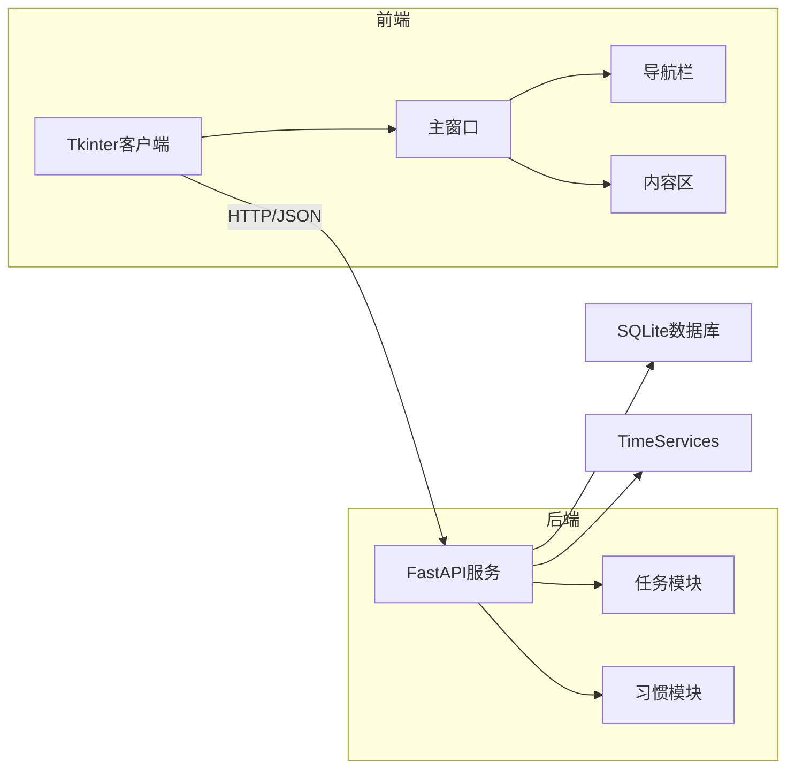
```mermaid
graph LR
    A[Tkinter客户端] -->|HTTP/JSON| B[FastAPI服务]
    B --> C[SQLite数据库]
    B --> D[TimeServices]
    subgraph 前端
        A --> E[主窗口]
        E --> F[导航栏]
        E --> G[内容区]
    end
    subgraph 后端
        B --> H[任务模块]
        B --> I[习惯模块]
    end
```
#### 2.3. 架构组件描述

| 组件类型 | 实现类/文件 | 职责 |
|----------|-------------|------|
| 前端框架 | main_window.py	 | 窗口主控/拖动逻辑 |
| 视图模块 | home.py/habitclockin.py | RESTful端点定义 |
| API服务  | tasks.py/habits.py	 | 数据统计分析 | 
| 业务逻辑 | services.py | 核心算法（如优先级计算） | 
| 数据持久化 | models.py/crud.py | 数据库模型与操作封装 | 


### 3. 模块设计

#### 3.1. 模块划分
| 模块名称 | 对应代码文件 | 核心功能 |
|----------|--------------|----------|
| 主窗口框架 | main_window.py	 | 基础窗口管理/导航控制 |
| 任务管理	 | home.py/services.py | 任务增删改查/树形展示 |
| 习惯追踪	 | habitclockin.py		 | 打卡记录管理/连续天数统计 | 
| 时间服务	 | services.py(TimeServices) | 日期计算/格式化 | 

#### 3.2. 模块交互流程
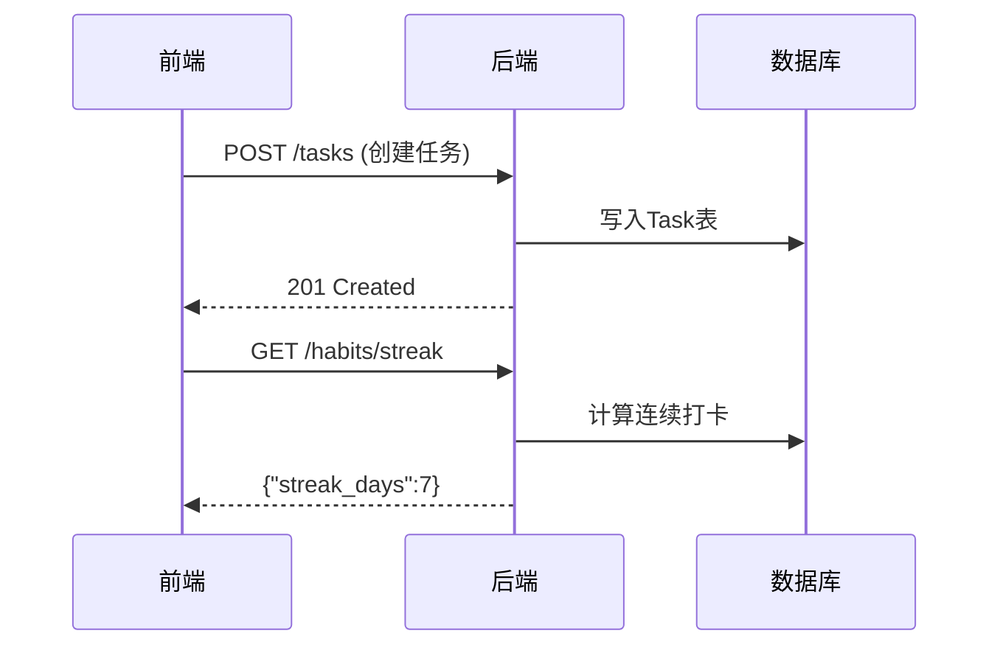
```mermaid
sequenceDiagram
    前端->>后端: POST /tasks (创建任务)
    后端->>数据库: 写入Task表
    后端-->>前端: 201 Created
    前端->>后端: GET /habits/streak 
    后端->>数据库: 计算连续打卡
    后端-->>前端: {"streak_days":7}
```

### 4. 技术选型

#### 4.1. 前端技术栈
| 技术 | 版本 | 选用理由 |
|----------|--------------|----------|
| Tkinter | Python内置 | 零依赖/快速原型开发 |
| ttk组件库 |  | 现代化样式支持 |

#### 4.2. 后端技术栈
|   技术   |     版本     | 关键特性 |
|----------|--------------|----------|
| FastAPI | 0.95+ | 自动API文档/异步支持 |
| Pydantic | 2.0+ | 强类型数据验证 |
| Uvicorn | 0.22+ | ASGI服务器 | 

#### 4.3. 数据存储
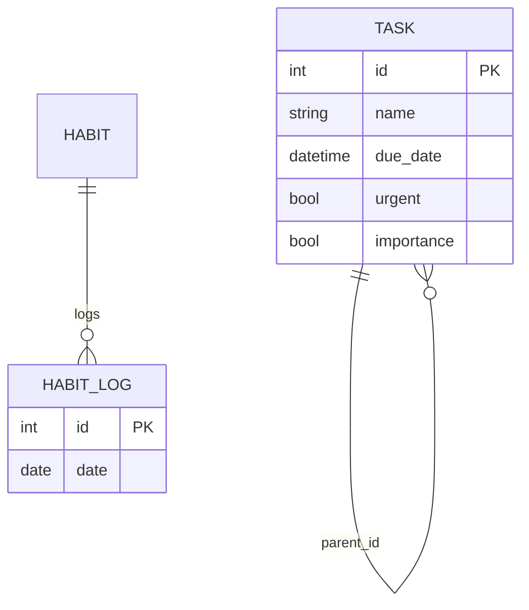
```mermaid
erDiagram
    TASK ||--o{ TASK : parent_id
    HABIT ||--o{ HABIT_LOG : logs
    TASK {
        int id PK
        string name
        datetime due_date
        bool urgent
        bool importance
    }
    HABIT_LOG {
        int id PK
        date date
    }
```


### 5. 关键设计

#### 5.1. 任务优先级算法

```python
# models.py

@property
def priority_parameter(self):
    return (self.importance * 0.45 + 
            self.urgent * 0.45 + 
            self._due_date_weight * 0.1)

```            

#### 5.2. 连续打卡统计
```python
# services.py

def get_habit_streak():
    current_date = date.today()
    while current_date in log_dates:
        streak += 1
        current_date -= timedelta(days=1)

```

### 6. 部署方案

#### 6.1. 开发环境

```python
# 后端启动
uvicorn main:app --reload

# 前端启动
python main_window.py

```

#### 6.2. 生产部署
|   组件   |   方案   |
|----------|----------|
| 前端 | PyInstaller打包exe | 
| 后端 | Docker容器+Nginx反向代理 |
| 数据库 | PostgreSQL主从集群 |


### 7. 附录

#### 7.1. 代码结构
```
.
├── app/ (backend)
│   ├── routers/
│   │   ├── habits.py
│   │   ├── tasks.py
│   │   └── __init__.py
│   ├── crud.py        
│   ├── db.py          
│   ├── main.py        
│   ├── models.py      
│   ├── schemas.py     
│   ├── services.py    
│   └── __init__.py
└── gui/ (frontend)
    ├── views/
    │   ├── calendar.py
    │   ├── habitclockin.py
    │   ├── home.py
    │   ├── timer.py
    │   └── __init__.py
    ├── widgets/
    │   ├── content_bar.py
    │   ├── navigation_bar.py
    │   ├── title_bar.py
    │   └── __init__.py
    ├── main_window.py  
    ├── services.py    
    ├── utils.py        
    ├── README.md
    └── __init__.py
```

#### 7.2 风险清单
|   风险项   |  应对措施  |
|------------|------------|
| Tkinter性能限制 | 复杂组件虚拟化渲染 | 
| SQLite并发能力 | 迁移至PostgreSQL |


---

# To-Do List 系统详细设计文档

**目录**

- [To-Do List 系统详细设计文档](#to-do-list-系统详细设计文档)
  - [📋 文档信息](#-文档信息)
  - [🎯 系统概述](#-系统概述)
    - [1.1 项目背景](#11-项目背景)
    - [1.2 设计目标](#12-设计目标)
    - [1.3 核心功能](#13-核心功能)
  - [🏗️ 系统架构设计](#️-系统架构设计)
    - [2.1 整体架构](#21-整体架构)
    - [2.2 技术架构](#22-技术架构)
  - [📊 数据库设计](#-数据库设计)
    - [3.1 数据库图](#31-数据库图)
    - [3.2 数据表详细设计](#32-数据表详细设计)
      - [3.2.1 Task（任务表）](#321-task任务表)
      - [3.2.2 Habit（习惯表）](#322-habit习惯表)
      - [3.2.3 HabitLog（习惯日志表）](#323-habitlog习惯日志表)
  - [🔧 API接口设计](#-api接口设计)
    - [4.1 接口规范](#41-接口规范)
      - [4.1.1 通用规范](#411-通用规范)
      - [4.1.2 响应状态码](#412-响应状态码)
    - [4.2 任务管理API](#42-任务管理api)
      - [4.2.1 创建任务](#421-创建任务)
      - [4.2.2 获取任务列表](#422-获取任务列表)
      - [4.2.3 更新任务](#423-更新任务)
      - [4.2.4 删除任务](#424-删除任务)
      - [4.2.5 搜索任务](#425-搜索任务)
      - [4.2.6 获取子任务](#426-获取子任务)
    - [4.3 习惯管理API](#43-习惯管理api)
      - [4.3.1 创建习惯](#431-创建习惯)
      - [4.3.2 习惯打卡](#432-习惯打卡)
      - [4.3.3 获取打卡记录](#433-获取打卡记录)
  - [💼 业务逻辑设计](#-业务逻辑设计)
    - [5.1 任务优先级算法](#51-任务优先级算法-1)
      - [5.1.1 算法原理](#511-算法原理)
      - [5.1.2 优先级矩阵](#512-优先级矩阵)
    - [5.2 习惯管理逻辑](#52-习惯管理逻辑)
      - [5.2.1 打卡规则](#521-打卡规则)
      - [5.2.2 习惯统计](#522-习惯统计)
    - [5.3 数据验证逻辑](#53-数据验证逻辑)
      - [5.3.1 任务验证](#531-任务验证)
      - [5.3.2 验证规则](#532-验证规则)
  - [🎨 前端设计](#-前端设计)
    - [6.1 界面设计](#61-界面设计)
      - [6.1.1 设计理念](#611-设计理念)
      - [6.1.2 Tkinter 桌面端界面设计](#612-tkinter-桌面端界面设计)
    - [6.2 页面结构](#62-页面结构)
      - [6.2.1 布局设计](#621-布局设计)
      - [6.2.2 组件设计](#622-组件设计)
    - [6.3 交互设计](#63-交互设计)
      - [6.3.1 任务操作流程](#631-任务操作流程)
      - [6.3.2 习惯打卡流程](#632-习惯打卡流程)
  - [🔐 安全设计](#-安全设计)
    - [7.1 数据安全](#71-数据安全)
      - [7.1.1 输入验证](#711-输入验证)
      - [7.1.2 数据完整性](#712-数据完整性)
  - [📈 性能优化](#-性能优化)
    - [8.1 数据库优化](#81-数据库优化)
      - [8.1.1 索引策略](#811-索引策略)
      - [8.1.2 查询优化](#812-查询优化)
  - [🧪 测试设计](#-测试设计)
    - [9.1 测试策略](#91-测试策略)
      - [9.1.1 测试分层](#911-测试分层)
    - [9.2 测试用例设计](#92-测试用例设计)
      - [9.2.1 任务管理测试](#921-任务管理测试)
      - [9.2.2 优先级算法测试](#922-优先级算法测试)
      - [9.2.3 Apifox和swagger ui的功能性能测试](#923-apifox和swagger-ui的功能性能测试)
  - [🚀 部署方案](#-部署方案)
    - [10.1 开发环境](#101-开发环境)
      - [10.1.1 环境要求](#1011-环境要求)
      - [10.1.2 启动步骤](#1012-启动步骤)
  - [📞 联系信息](#-联系信息)

## 📋 文档信息

| 项目信息 | 详情 |
|---------|------|
| **项目名称** | 高效生活 - TodoList 管理系统 |
| **版本号** | v1.0.0 |
| **文档版本** | v1.0 |
| **创建日期** | 2025年7月4日 |
| **技术栈** | FastAPI + SQLAlchemy + (HTML + JavaScript) / Tkinter |

---

## 🎯 系统概述

### 1.1 项目背景
本项目旨在开发一个现代化的个人效率管理系统，集成任务管理、习惯打卡、番茄钟和日历功能，帮助用户提高工作效率和生活质量。

### 1.2 设计目标
- **易用性**：简洁直观的用户界面
- **高效性**：智能优先级算法，优化任务管理
- **扩展性**：模块化设计，便于功能扩展
- **稳定性**：完善的错误处理和数据持久化

### 1.3 核心功能
1. **任务管理**：增删改查、优先级计算、层级结构
2. **习惯打卡**：习惯管理、日志记录、数据统计
3. **番茄钟**：专注时间管理、工作统计
4. **日历视图**：任务与日期关联、可视化展示

---

## 🏗️ 系统架构设计

### 2.1 整体架构

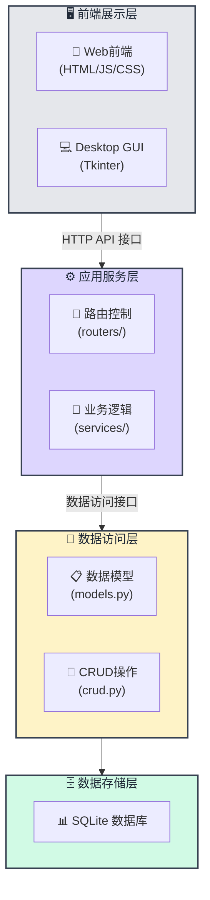
```mermaid
flowchart TD
    subgraph 前端展示层["🖥️ 前端展示层"]
        direction LR
        WebUI["📱 Web前端<br/>(HTML/JS/CSS)"]
        DesktopGUI["💻 Desktop GUI<br/>(Tkinter)"]
    end
    
    subgraph 应用服务层["⚙️ 应用服务层"]
        direction LR
        Router["🔀 路由控制<br/>(routers/)"]
        Service["🧠 业务逻辑<br/>(services/)"]
    end
    
    subgraph 数据访问层["💾 数据访问层"]
        direction LR
        Models["📋 数据模型<br/>(models.py)"]
        CRUD["🔧 CRUD操作<br/>(crud.py)"]
    end
    
    subgraph 数据存储层["🗄️ 数据存储层"]
        Database["📊 SQLite 数据库"]
    end
    
    前端展示层 -->|HTTP API 接口| 应用服务层
    应用服务层 -->|数据访问接口| 数据访问层
    数据访问层 --> 数据存储层
    
    classDef frontendStyle fill:#e5e7eb,stroke:#374151,stroke-width:2px,color:#1f2937
    classDef serviceStyle fill:#ddd6fe,stroke:#374151,stroke-width:2px,color:#1f2937
    classDef dataStyle fill:#fef3c7,stroke:#374151,stroke-width:2px,color:#1f2937
    classDef storageStyle fill:#d1fae5,stroke:#374151,stroke-width:2px,color:#1f2937
    
    class 前端展示层 frontendStyle
    class 应用服务层 serviceStyle
    class 数据访问层 dataStyle
    class 数据存储层 storageStyle
```

### 2.2 技术架构

| 层级 | 技术选型 | 说明 |
|------|----------|------|
| **前端2.0** | HTML + CSS + JavaScript | 响应式Web界面 |
| **GUI** | Python Tkinter | 桌面应用界面 |
| **后端** | FastAPI + Python 3.8+ | 高性能异步Web框架 |
| **ORM** | SQLAlchemy 2.0 | 现代化数据库ORM |
| **数据库** | SQLite | 轻量级嵌入式数据库 |
| **验证** | Pydantic v2 | 数据验证和序列化 |

---

## 📊 数据库设计

### 3.1 数据库图

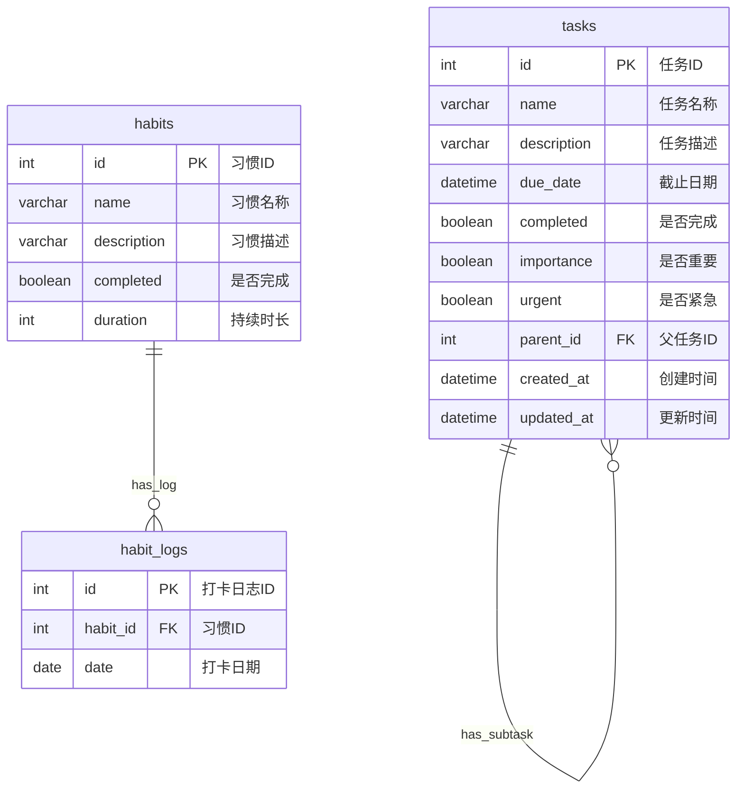
```mermaid
erDiagram
    tasks {
        int id PK "任务ID"
        varchar name "任务名称"
        varchar description "任务描述"
        datetime due_date "截止日期"
        boolean completed "是否完成"
        boolean importance "是否重要"
        boolean urgent "是否紧急"
        int parent_id FK "父任务ID"
        datetime created_at "创建时间"
        datetime updated_at "更新时间"
    }

    habits {
        int id PK "习惯ID"
        varchar name "习惯名称"
        varchar description "习惯描述"
        boolean completed "是否完成"
        int duration "持续时长"
    }

    habit_logs {
        int id PK "打卡日志ID"
        int habit_id FK "习惯ID"
        date date "打卡日期"
    }

    tasks ||--o{ tasks : "has_subtask"
    habits ||--o{ habit_logs : "has_log"
```

### 3.2 数据表详细设计

#### 3.2.1 Task（任务表）

| 字段名 | 类型 | 约束 | 说明 |
|--------|------|------|------|
| id | INTEGER | PRIMARY KEY | 任务唯一标识 |
| name | VARCHAR(255) | NOT NULL, INDEX | 任务名称 |
| description | TEXT | NULLABLE | 任务描述 |
| due_date | DATETIME | NULLABLE | 截止日期 |
| completed | BOOLEAN | NOT NULL, DEFAULT FALSE | 完成状态 |
| importance | BOOLEAN | NOT NULL, DEFAULT FALSE | 重要标识 |
| urgent | BOOLEAN | NOT NULL, DEFAULT FALSE | 紧急标识 |
| parent_id | INTEGER | FOREIGN KEY, NULLABLE | 父任务ID |
| created_at | DATETIME | NOT NULL | 创建时间 |
| updated_at | DATETIME | NOT NULL | 更新时间 |

**关系设计**：
- 自引用关系：支持父子任务结构
- 级联删除：删除父任务时，子任务一并删除

#### 3.2.2 Habit（习惯表）

| 字段名 | 类型 | 约束 | 说明 |
|--------|------|------|------|
| id | INTEGER | PRIMARY KEY | 习惯唯一标识 |
| name | VARCHAR(128) | NOT NULL, UNIQUE | 习惯名称 |
| description | TEXT | NULLABLE | 习惯描述 |
| completed | BOOLEAN | NOT NULL, DEFAULT FALSE | 当日完成状态 |
| duration | INTEGER | NOT NULL, DEFAULT 0 | 持续天数 |

#### 3.2.3 HabitLog（习惯日志表）

| 字段名 | 类型 | 约束 | 说明 |
|--------|------|------|------|
| id | INTEGER | PRIMARY KEY | 日志唯一标识 |
| habit_id | INTEGER | FOREIGN KEY, NOT NULL | 关联习惯ID |
| date | DATE | NOT NULL, DEFAULT TODAY | 打卡日期 |

**约束设计**：
- 唯一性约束：`(habit_id, date)` 确保每日只能打卡一次

---

## 🔧 API接口设计

### 4.1 接口规范

#### 4.1.1 通用规范
- **协议**：HTTP/HTTPS
- **数据格式**：JSON
- **字符编码**：UTF-8
- **API版本**：v1
- **Base URL**：`http://127.0.0.1:8000`

#### 4.1.2 响应状态码
| 状态码 | 说明 |
|--------|------|
| 200 | 请求成功 |
| 201 | 创建成功 |
| 204 | 删除成功 |
| 400 | 请求参数错误 |
| 404 | 资源不存在 |
| 500 | 服务器内部错误 |

### 4.2 任务管理API

#### 4.2.1 创建任务
```http
POST /tasks
Content-Type: application/json

{
    "name": "完成项目设计文档",
    "description": "编写详细的系统设计文档",
    "due_date": "2025-07-05T18:00:00",
    "importance": true,
    "urgent": false,
    "parent_id": null
}
```

**响应示例**：
```json
{
    "id": 1,
    "name": "完成项目设计文档",
    "description": "编写详细的系统设计文档",
    "due_date": "2025-07-05T18:00:00",
    "completed": false,
    "importance": true,
    "urgent": false,
    "parent_id": 0,
    "created_at": "2025-07-04T10:00:00",
    "updated_at": "2025-07-04T10:00:00"
}
```

#### 4.2.2 获取任务列表
```http
GET /tasks?status=pending&sort_by=priority
```

**查询参数**：
- `status`: `all`|`pending`|`completed`
- `sort_by`: `priority`|`id`|`ddl`

#### 4.2.3 更新任务
```http
PATCH /tasks/{task_id}
Content-Type: application/json

{
    "completed": true
}
```

#### 4.2.4 删除任务
```http
DELETE /tasks/{task_id}
```

#### 4.2.5 搜索任务
```http
GET /tasks/search?q=设计
```

#### 4.2.6 获取子任务
```http
GET /tasks/{task_id}/children
```

### 4.3 习惯管理API

#### 4.3.1 创建习惯
```http
POST /habits
Content-Type: application/json

{
    "name": "早起锻炼",
    "description": "每天早上6点起床锻炼30分钟",
    "duration": 21
}
```

#### 4.3.2 习惯打卡
```http
POST /habits/{habit_id}/logs
Content-Type: application/json

{}
```

#### 4.3.3 获取打卡记录
```http
GET /habits/{habit_id}/logs
```

---

## 💼 业务逻辑设计

### 5.1 任务优先级算法

#### 5.1.1 算法原理
任务优先级基于三个维度计算：重要性、紧急性、截止日期

```python
def priority_parameter(self) -> float:
    """
    计算任务优先级 (0~1)
    """
    if self.completed:
        return 0.0

    # 权重配置
    importance_weight = 0.45  # 重要性权重
    urgent_weight = 0.45      # 紧急性权重
    due_date_weight = 0.10    # 截止日期权重

    # 基础值计算
    importance_value = 1 if self.importance else 0
    urgent_value = 1 if self.urgent else 0

    # 截止日期处理
    if self.due_date:
        days_to_due = (self.due_date - datetime.now()).days
        if days_to_due < 0:
            due_date_value = 1.0  # 已超期
        else:
            due_date_value = 1 / (days_to_due + 1)
    else:
        due_date_value = 0.0  # 无截止日期

    return (
        importance_value * importance_weight +
        urgent_value * urgent_weight +
        due_date_value * due_date_weight
    )
```

#### 5.1.2 优先级矩阵

| 重要性 | 紧急性 | 基础得分 | 描述 |
|--------|--------|----------|------|
| 是 | 是 | 0.90 | 重要且紧急，优先处理 |
| 是 | 否 | 0.45 | 重要不紧急，计划安排 |
| 否 | 是 | 0.45 | 不重要但紧急，快速处理 |
| 否 | 否 | 0.00 | 不重要不紧急，延后处理 |

### 5.2 习惯管理逻辑

#### 5.2.1 打卡规则
- 每个习惯每天只能打卡一次
- 使用 `(habit_id, date)` 唯一约束确保数据完整性
- 打卡时自动记录当前日期

#### 5.2.2 习惯统计
- **连续天数**：计算连续打卡的天数
- **完成率**：计算指定时间段内的完成率
- **趋势分析**：展示习惯完成的时间趋势

### 5.3 数据验证逻辑

#### 5.3.1 任务验证
```python
class TaskCreate(BaseModel):
    name: str = Field(..., max_length=255)
    description: str | None = None
    due_date: datetime | None = None
    importance: bool = False
    urgent: bool = False
    parent_id: int | None = None
```

#### 5.3.2 验证规则
- **任务名称**：必填，最大长度255字符
- **截止日期**：可选，必须是有效的日期时间格式
- **父任务**：可选，必须是已存在的任务ID

---

## 🎨 前端设计

### 6.1 界面设计

#### 6.1.1 设计理念
- **简洁性**：界面简洁，操作直观
- **一致性**：统一的视觉语言和交互模式
- **响应性**：适配不同屏幕尺寸
- **可访问性**：支持键盘导航和屏幕阅读器

#### 6.1.2 Tkinter 桌面端界面设计
- **主窗口**：包含任务列表、习惯打卡、番茄钟等Tab页，顶部为菜单栏，左侧为功能导航。
- **任务区**：使用 Listbox 或 Treeview 展示任务，支持勾选完成、右键菜单编辑/删除。
- **习惯区**：以列表或表格形式展示习惯，打卡按钮直接操作，打卡后状态变更。
- **番茄钟**：独立Tab，显示倒计时、开始/暂停/重置按钮，完成后弹窗提醒。
- **交互说明**：所有操作均有弹窗或状态栏反馈，界面风格简洁，适合Windows风格。

### 6.2 页面结构

#### 6.2.1 布局设计
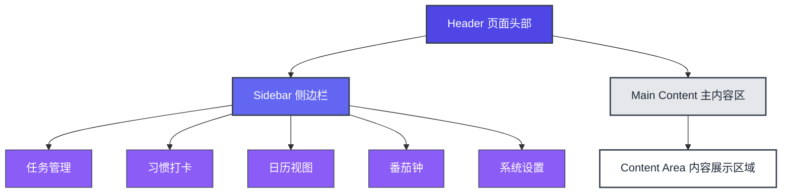
```mermaid
graph TD
    H[Header 页面头部]
    S[Sidebar 侧边栏]
    M[Main Content 主内容区]
    T[任务管理]
    H1[习惯打卡]
    C[日历视图]
    Ti[番茄钟]
    Se[系统设置]
    CA[Content Area 内容展示区域]
    
    H --> S
    H --> M
    S --> T
    S --> H1
    S --> C
    S --> Ti
    S --> Se
    M --> CA
    
    classDef headerStyle fill:#4f46e5,stroke:#374151,stroke-width:2px,color:#ffffff
    classDef sidebarStyle fill:#6366f1,stroke:#374151,stroke-width:2px,color:#ffffff
    classDef contentStyle fill:#e5e7eb,stroke:#374151,stroke-width:2px,color:#1f2937
    classDef areaStyle fill:#ffffff,stroke:#374151,stroke-width:2px,color:#1f2937
    classDef menuStyle fill:#8b5cf6,stroke:#374151,stroke-width:1px,color:#ffffff
    
    class H headerStyle
    class S sidebarStyle
    class M contentStyle
    class CA areaStyle
    class T,H1,C,Ti,Se menuStyle
```

#### 6.2.2 组件设计

**任务组件**：
```html
<div class="task-item">
    <input type="checkbox" class="task-checkbox">
    <div class="task-content">
        <h3 class="task-title">任务名称</h3>
        <p class="task-description">任务描述</p>
        <div class="task-meta">
            <span class="task-due-date">截止日期</span>
            <span class="task-priority">优先级</span>
        </div>
    </div>
    <div class="task-actions">
        <button class="edit-btn">编辑</button>
        <button class="delete-btn">删除</button>
    </div>
</div>
```

### 6.3 交互设计

#### 6.3.1 任务操作流程
1. **创建任务**：点击"创建任务" → 填写表单 → 提交保存
2. **完成任务**：点击复选框 → 任务状态更新 → 视觉反馈
3. **编辑任务**：点击编辑按钮 → 弹出编辑框 → 修改保存
4. **删除任务**：点击删除按钮 → 确认对话框 → 删除操作

#### 6.3.2 习惯打卡流程
1. **查看习惯**：进入习惯页面 → 显示习惯列表
2. **完成打卡**：点击打卡按钮 → 记录打卡 → 更新状态

---

## 🔐 安全设计

### 7.1 数据安全

#### 7.1.1 输入验证
- 使用 Pydantic 进行数据验证
- SQL注入防护：使用 SQLAlchemy ORM

#### 7.1.2 数据完整性
- 数据库约束：外键约束、唯一性约束
- 事务处理：确保数据一致性
- 错误处理：异常捕获和错误回滚


---

## 📈 性能优化

### 8.1 数据库优化

#### 8.1.1 索引策略
```sql
-- 任务表索引
CREATE INDEX idx_task_name ON tasks(name);
CREATE INDEX idx_task_completed ON tasks(completed);
CREATE INDEX idx_task_due_date ON tasks(due_date);
CREATE INDEX idx_task_parent_id ON tasks(parent_id);

-- 习惯表索引
CREATE INDEX idx_habit_name ON habits(name);
CREATE INDEX idx_habitlog_date ON habit_logs(date);
```

#### 8.1.2 查询优化
- 避免 N+1 查询：使用 SQLAlchemy 的 `joinedload`
- 分页查询：大数据集使用分页
- 查询缓存：频繁查询结果缓存

---

## 🧪 测试设计

### 9.1 测试策略

#### 9.1.1 测试分层

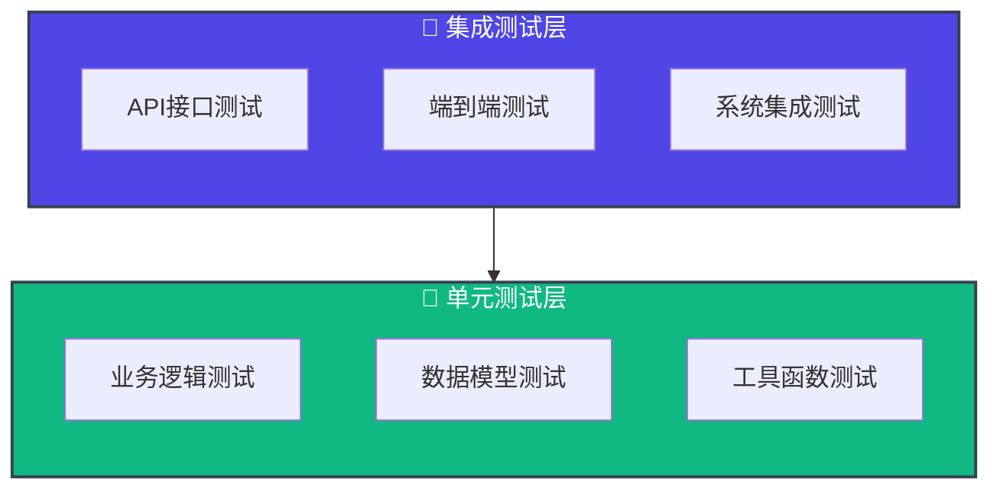
```mermaid
flowchart TD
    subgraph 集成测试["🔗 集成测试层"]
        direction TB
        A1["API接口测试"]
        A2["端到端测试"]
        A3["系统集成测试"]
    end
    
    subgraph 单元测试["🧪 单元测试层"]
        direction TB
        B1["业务逻辑测试"]
        B2["数据模型测试"]
        B3["工具函数测试"]
    end
    
    集成测试 --> 单元测试
    
    classDef integrationStyle fill:#4f46e5,stroke:#374151,stroke-width:2px,color:#ffffff
    classDef unitStyle fill:#10b981,stroke:#374151,stroke-width:2px,color:#ffffff
    
    class 集成测试 integrationStyle
    class 单元测试 unitStyle
```


### 9.2 测试用例设计

#### 9.2.1 任务管理测试
```python
def test_task_crud_and_subtree():
    """测试任务的CRUD操作和子任务功能"""
    # 创建父任务
    response = client.post("/tasks", json={
        "name": "父任务",
        "importance": True,
        "urgent": False
    })
    assert response.status_code == 201
    parent_id = response.json()["id"]
    
    # 创建子任务
    client.post("/tasks", json={
        "name": "子任务1",
        "parent_id": parent_id
    })
    
    # 验证子任务数量
    response = client.get(f"/tasks/{parent_id}/children")
    assert len(response.json()) == 1
```

#### 9.2.2 优先级算法测试
```python
def test_priority_calculation():
    """测试任务优先级计算算法"""
    # 重要且紧急的任务
    task1 = Task(importance=True, urgent=True, completed=False)
    assert task1.priority_parameter == 0.9
    
    # 已完成的任务
    task2 = Task(completed=True)
    assert task2.priority_parameter == 0.0
```

#### 9.2.3 Apifox和swagger ui的功能性能测试
具体见本项目测试文档

---

## 🚀 部署方案

### 10.1 开发环境

#### 10.1.1 环境要求
- Python 3.8+
- Node.js 16+ (前端开发)
- SQLite 3.x

#### 10.1.2 启动步骤
```bash
# 1. 创建虚拟环境
python -m venv .venv
source .venv/bin/activate  # Windows: .venv\Scripts\activate

# 2. 安装依赖
pip install -r requirements-dev.txt

# 3. 启动开发服务器
uvicorn src.app.main:app --reload

# 4. 启动桌面应用
python run.py
```

---


## 📞 联系信息

**项目团队**：TodoList 开发团队  
**技术负责人**：牛茂润 杨晓舒 李锡浩 严晨 顾晨昊  
**项目经理**：牛茂润  
**文档维护**：严晨 李锡浩 牛茂润
**最后更新**：2025年7月7日

---

# Todo-List 接口设计文档

* **文档版本：** V3.0
* **编写人：** 严晨 顾晨昊
* **编写日期：** 2025年07月04日
* **最后修订日期：** 2025年07月05日

**目录**
- [**Todo-List 接口设计文档**](#todo-list-接口设计文档)
  - [API 概述](#api-概述)
    - [1.1 设计原则](#11-设计原则)
    - [1.2 基础信息](#12-基础信息)
  - [API 模块划分](#api-模块划分)
    - [2.1 功能模块](#21-功能模块)
    - [2.2 数据模型层次](#22-数据模型层次)
  - [任务管理 API](#任务管理-api)
    - [3.1 创建任务](#31-创建任务)
    - [3.2 获取任务列表](#32-获取任务列表)
    - [3.3 获取单个任务](#33-获取单个任务)
    - [3.4 更新任务](#34-更新任务)
    - [3.5 删除任务](#35-删除任务)
    - [3.6 搜索任务](#36-搜索任务)
    - [3.7 获取子任务列表](#37-获取子任务列表)
  - [习惯管理 API](#习惯管理-api)
    - [4.1 创建习惯](#41-创建习惯)
    - [4.2 获取习惯列表](#42-获取习惯列表)
    - [4.3 习惯打卡](#43-习惯打卡)
    - [4.4 获取打卡记录](#44-获取打卡记录)
    - [4.5 获取连续打卡天数](#45-获取连续打卡天数)
    - [4.6 删除习惯](#46-删除习惯)
  - [系统管理 API](#系统管理-api)
    - [5.1 健康检查](#51-健康检查)
    - [5.2 API信息](#52-api信息)
  - [数据模型定义](#数据模型定义)
    - [6.1 任务模型](#61-任务模型)
      - [TaskBase（基础任务模型）](#taskbase基础任务模型)
      - [TaskCreate（任务创建模型）](#taskcreate任务创建模型)
      - [TaskUpdate（任务更新模型）](#taskupdate任务更新模型)
      - [TaskOut（任务输出模型）](#taskout任务输出模型)
    - [6.2 习惯模型](#62-习惯模型)
      - [HabitBase（基础习惯模型）](#habitbase基础习惯模型)
      - [HabitOut（习惯输出模型）](#habitout习惯输出模型)
      - [HabitLogOut（打卡日志输出模型）](#habitlogout打卡日志输出模型)
  - [安全与认证](#安全与认证)
    - [7.1 当前安全措施](#71-当前安全措施)
  - [测试与验证](#测试与验证)
    - [8.1 API测试用例](#81-api测试用例)
      - [任务管理测试](#任务管理测试)
      - [习惯管理测试](#习惯管理测试)
    - [8.2 错误场景测试](#82-错误场景测试)
  - [API使用示例](#api使用示例)
    - [9.1 完整工作流程示例](#91-完整工作流程示例)
      - [Python 客户端示例](#python-客户端示例)
  - [相关资源](#相关资源)
    - [10.1 开发工具](#101-开发工具)
    - [10.2 参考文档](#102-参考文档)
  - [附录](#附录)
    - [A.1 HTTP状态码说明](#a1-http状态码说明)
    - [A.2 错误响应格式](#a2-错误响应格式)
    - [A.3 日期时间格式](#a3-日期时间格式)
  - [联系信息](#联系信息)


##  API 概述

### 1.1 设计原则

本项目API遵循RESTful设计规范，采用FastAPI框架开发，具有以下特点：

**核心特性**：
- **自动文档生成**：基于OpenAPI 3.0规范自动生成交互式API文档
- **数据验证**：使用Pydantic进行请求/响应数据验证
- **类型安全**：完整的类型注解和验证
- **中文化支持**：接口描述和错误信息中文化
- **标准化响应**：统一的HTTP状态码和错误处理

### 1.2 基础信息

**服务地址**：
- 开发环境：`http://127.0.0.1:8000`

**API文档地址**：
- Swagger UI：`http://127.0.0.1:8000/docs`
- OpenAPI Schema：`http://127.0.0.1:8000/openapi.json`

**支持格式**：
- 请求格式：`application/json`
- 响应格式：`application/json`
- 字符编码：`UTF-8`

---

##  API 模块划分

### 2.1 功能模块

| 模块 | 前缀 | 描述 | 主要功能 |
|------|------|------|----------|
| **任务管理** | `/tasks` | 待办事项管理 | 增删改查、搜索、排序 |
| **习惯管理** | `/habits` | 习惯养成管理 | 习惯CRUD、打卡记录 |
| **统计分析** | `/stats` | 数据统计分析 | 效率统计、趋势分析 |
| **系统管理** | `/system` | 系统功能 | 健康检查、配置管理 |

### 2.2 数据模型层次

```
BaseModel (Pydantic基类)
├── TaskBase (任务基础模型)
│   ├── TaskCreate (任务创建)
│   ├── TaskUpdate (任务更新)
│   └── TaskOut (任务输出)
├── HabitBase (习惯基础模型)
│   ├── HabitCreate (习惯创建)
│   ├── HabitUpdate (习惯更新)
│   └── HabitOut (习惯输出)
└── HabitLogCreate/Out (打卡日志)
```

---

##  任务管理 API

### 3.1 创建任务

**接口信息**：
- **方法**：`POST`
- **路径**：`/tasks`
- **描述**：创建新的待办任务

**请求参数**：
```json
{
    "name": "完成项目文档",
    "description": "编写详细的API接口文档",
    "due_date": "2025-07-10T18:00:00",
    "importance": true,
    "urgent": false,
    "parent_id": null
}
```

**参数说明**：

| 字段 | 类型 | 是否必填 |   描述   |    示例    |
|------|------|----------|----------|------------|
| **name** | string | 是 | 任务名称，最大255字符 | "完成项目文档" |
| **description** | string | 否 | 任务描述 | "编写详细的API接口文档" |
| **due_date** | datetime | 否 | 截止日期，ISO 8601格式 | "2025-07-10T18:00:00" |
| **importance** | boolean | 否 | 是否重要，默认false | true |
| **urgent** | boolean | 否 | 是否紧急，默认false | false |
| **parent_id** | integer | 否 | 父任务ID，用于创建子任务 | null |

**响应示例**：
```json
{
    "id": 1,
    "name": "完成项目文档",
    "description": "编写详细的API接口文档",
    "due_date": "2025-07-10T18:00:00",
    "importance": true,
    "urgent": false,
    "parent_id": 0,
    "completed": false,
    "created_at": "2025-07-05T10:00:00.123456",
    "updated_at": "2025-07-05T10:00:00.123456"
}
```

**状态码**：
- `201`：创建成功
- `400`：请求参数错误
- `422`：数据验证失败

### 3.2 获取任务列表

**接口信息**：
- **方法**：`GET`
- **路径**：`/tasks`
- **描述**：获取任务列表，支持过滤和排序

**查询参数**：

| 参数 | 类型 | 必填 | 描述 | 可选值 |
|------|------|------|------|--------|
| status | string | 否 | 任务状态过滤 | `all`, `pending`, `completed` |
| sort_by | string | 否 | 排序方式，默认priority | `priority`, `id`, `ddl` |

**请求示例**：

```http
GET /tasks?status=pending&sort_by=priority
```

**响应示例**：

```json
[
    {
        "id": 1,
        "name": "完成项目文档",
        "description": "编写详细的API接口文档",
        "due_date": "2025-07-10T18:00:00",
        "importance": true,
        "urgent": false,
        "parent_id": 0,
        "completed": false,
        "created_at": "2025-07-05T10:00:00.123456",
        "updated_at": "2025-07-05T10:00:00.123456"
    },
    {
        "id": 2,
        "name": "代码审查",
        "description": "审查任务管理模块代码",
        "due_date": "2025-07-08T17:00:00",
        "importance": false,
        "urgent": true,
        "parent_id": 0,
        "completed": false,
        "created_at": "2025-07-05T11:00:00.123456",
        "updated_at": "2025-07-05T11:00:00.123456"
    }
]
```

**状态码**：
- `200`：获取成功
- `400`：查询参数错误

### 3.3 获取单个任务

**接口信息**：
- **方法**：`GET`
- **路径**：`/tasks/{task_id}`
- **描述**：根据ID获取指定任务详情

**路径参数**：

| 参数 | 类型 | 必填 | 描述 |
|------|------|------|------|
| task_id | integer | 是 | 任务ID |

**请求示例**：
```http
GET /tasks/1
```

**响应示例**：
```json
{
    "id": 1,
    "name": "完成项目文档",
    "description": "编写详细的API接口文档",
    "due_date": "2025-07-10T18:00:00",
    "importance": true,
    "urgent": false,
    "parent_id": 0,
    "completed": false,
    "created_at": "2025-07-05T10:00:00.123456",
    "updated_at": "2025-07-05T10:00:00.123456"
}
```

**状态码**：
- `200`：获取成功
- `404`：任务不存在

### 3.4 更新任务

**接口信息**：
- **方法**：`PATCH`
- **路径**：`/tasks/{task_id}`
- **描述**：更新指定任务的部分信息

**路径参数**：

| 参数 | 类型 | 必填 | 描述 |
|------|------|------|------|
| task_id | integer | 是 | 任务ID |

**请求参数**（部分更新）：
```json
{
    "completed": true,
    "description": "API接口文档已完成编写"
}
```

**响应示例**：
```json
{
    "id": 1,
    "name": "完成项目文档",
    "description": "API接口文档已完成编写",
    "due_date": "2025-07-10T18:00:00",
    "importance": true,
    "urgent": false,
    "parent_id": 0,
    "completed": true,
    "created_at": "2025-07-05T10:00:00.123456",
    "updated_at": "2025-07-05T14:30:00.789012"
}
```

**状态码**：
- `200`：更新成功
- `400`：请求参数错误
- `404`：任务不存在
- `422`：数据验证失败

### 3.5 删除任务

**接口信息**：
- **方法**：`DELETE`
- **路径**：`/tasks/{task_id}`
- **描述**：删除指定任务（包括子任务）

**路径参数**：

| 参数 | 类型 | 必填 | 描述 |
|------|------|------|------|
| task_id | integer | 是 | 任务ID |

**请求示例**：
```http
DELETE /tasks/1
```

**响应**：无内容（204状态码）

**状态码**：
- `204`：删除成功
- `404`：任务不存在

### 3.6 搜索任务

**接口信息**：
- **方法**：`GET`
- **路径**：`/tasks/search`
- **描述**：根据关键词搜索任务

**查询参数**：

| 参数 | 类型 | 必填 | 描述 |
|------|------|------|------|
| q | string | 是 | 搜索关键词，最少1个字符 |

**请求示例**：
```http
GET /tasks/search?q=文档
```

**响应示例**：
```json
[
    {
        "id": 1,
        "name": "完成项目文档",
        "description": "编写详细的API接口文档",
        "due_date": "2025-07-10T18:00:00",
        "importance": true,
        "urgent": false,
        "parent_id": 0,
        "completed": false,
        "created_at": "2025-07-05T10:00:00.123456",
        "updated_at": "2025-07-05T10:00:00.123456"
    }
]
```

**状态码**：
- `200`：搜索成功
- `400`：查询参数错误

### 3.7 获取子任务列表

**接口信息**：
- **方法**：`GET`
- **路径**：`/tasks/{task_id}/children`
- **描述**：获取指定任务的直接子任务列表

**路径参数**：

| 参数 | 类型 | 必填 | 描述 |
|------|------|------|------|
| task_id | integer | 是 | 父任务ID |

**请求示例**：
```http
GET /tasks/1/children
```

**响应示例**：
```json
[
    {
        "id": 3,
        "name": "编写需求分析",
        "description": "分析用户需求和系统需求",
        "due_date": "2025-07-07T18:00:00",
        "importance": true,
        "urgent": false,
        "parent_id": 1,
        "completed": false,
        "created_at": "2025-07-05T12:00:00.123456",
        "updated_at": "2025-07-05T12:00:00.123456"
    },
    {
        "id": 4,
        "name": "编写接口设计",
        "description": "设计API接口规范",
        "due_date": "2025-07-08T18:00:00",
        "importance": true,
        "urgent": false,
        "parent_id": 1,
        "completed": false,
        "created_at": "2025-07-05T12:30:00.123456",
        "updated_at": "2025-07-05T12:30:00.123456"
    }
]
```

**状态码**：
- `200`：获取成功
- `404`：父任务不存在

---

##  习惯管理 API

### 4.1 创建习惯

**接口信息**：
- **方法**：`POST`
- **路径**：`/habits`
- **描述**：创建新的习惯

**请求参数**：
```json
{
    "name": "早起锻炼",
    "description": "每天早上6点起床锻炼30分钟",
    "duration": 21
}
```

**参数说明**：

| 字段 | 类型 | 必填 | 描述 | 示例 |
|------|------|------|------|------|
| name | string | 是 | 习惯名称，最大128字符 | "早起锻炼" |
| description | string | 否 | 习惯描述 | "每天早上6点起床锻炼30分钟" |
| duration | integer | 否 | 目标持续天数，默认0 | 21 |

**响应示例**：
```json
{
    "id": 1,
    "name": "早起锻炼",
    "description": "每天早上6点起床锻炼30分钟",
    "duration": 21,
    "logs": []
}
```

**状态码**：
- `201`：创建成功
- `400`：请求参数错误
- `422`：数据验证失败

### 4.2 获取习惯列表

**接口信息**：
- **方法**：`GET`
- **路径**：`/habits`
- **描述**：获取所有习惯列表

**请求示例**：
```http
GET /habits
```

**响应示例**：
```json
[
    {
        "id": 1,
        "name": "早起锻炼",
        "description": "每天早上6点起床锻炼30分钟",
        "duration": 21,
        "logs": [
            {
                "id": 1,
                "habit_id": 1,
                "date": "2025-07-05T00:00:00"
            },
            {
                "id": 2,
                "habit_id": 1,
                "date": "2025-07-04T00:00:00"
            }
        ]
    },
    {
        "id": 2,
        "name": "阅读",
        "description": "每天阅读30分钟",
        "duration": 30,
        "logs": []
    }
]
```

**状态码**：
- `200`：获取成功

### 4.3 习惯打卡

**接口信息**：
- **方法**：`POST`
- **路径**：`/habits/{habit_id}/logs`
- **描述**：为指定习惯记录打卡

**路径参数**：

| 参数 | 类型 | 必填 | 描述 |
|------|------|------|------|
| habit_id | integer | 是 | 习惯ID |

**请求参数**：
```json
{
    "date": "2025-07-05T00:00:00"
}
```


**参数说明**：

| 字段 | 类型 | 必填 | 描述 |
|------|------|------|------|
| date | datetime | 否 | 打卡日期，默认当天 |

**响应示例**：
```json
{
    "id": 3,
    "habit_id": 1,
    "date": "2025-07-05T00:00:00"
}
```

**状态码**：
- `201`：打卡成功
- `400`：请求参数错误
- `404`：习惯不存在
- `409`：今日已打卡

### 4.4 获取打卡记录

**接口信息**：
- **方法**：`GET`
- **路径**：`/habits/{habit_id}/logs`
- **描述**：获取指定习惯的所有打卡记录

**路径参数**：

| 参数 | 类型 | 必填 | 描述 |
|------|------|------|------|
| habit_id | integer | 是 | 习惯ID |

**请求示例**：
```http
GET /habits/1/logs
```

**响应示例**：
```json
[
    {
        "id": 3,
        "habit_id": 1,
        "date": "2025-07-05T00:00:00"
    },
    {
        "id": 2,
        "habit_id": 1,
        "date": "2025-07-04T00:00:00"
    },
    {
        "id": 1,
        "habit_id": 1,
        "date": "2025-07-03T00:00:00"
    }
]
```

**状态码**：
- `200`：获取成功
- `404`：习惯不存在

### 4.5 获取连续打卡天数

**接口信息**：
- **方法**：`GET`
- **路径**：`/habits/{habit_id}/streak`
- **描述**：获取指定习惯的当前连续打卡天数

**路径参数**：

| 参数 | 类型 | 必填 | 描述 |
|------|------|------|------|
| habit_id | integer | 是 | 习惯ID |

**请求示例**：
```http
GET /habits/1/streak
```

**响应示例**：
```json
7
```

**状态码**：
- `200`：获取成功
- `404`：习惯不存在

### 4.6 删除习惯

**接口信息**：
- **方法**：`DELETE`
- **路径**：`/habits/{habit_id}`
- **描述**：删除指定习惯及其所有打卡记录

**路径参数**：

| 参数 | 类型 | 必填 | 描述 |
|------|------|------|------|
| habit_id | integer | 是 | 习惯ID |

**请求示例**：
```http
DELETE /habits/1
```

**响应**：无内容（204状态码）

**状态码**：
- `204`：删除成功
- `404`：习惯不存在

---

##  系统管理 API

### 5.1 健康检查

**接口信息**：
- **方法**：`GET`
- **路径**：`/health`
- **描述**：检查API服务状态

**请求示例**：
```http
GET /health
```

**响应示例**：
```json
{
    "status": "healthy",
    "timestamp": "2025-07-05T10:00:00.123456",
    "version": "1.0.0",
    "database": "connected"
}
```

### 5.2 API信息

**接口信息**：
- **方法**：`GET`
- **路径**：`/info`
- **描述**：获取API基本信息

**响应示例**：
```json
{
    "name": "TodoList API",
    "version": "1.0.0",
    "description": "高效生活 - TodoList 管理系统API",
    "documentation": "http://127.0.0.1:8000/docs",
    "contact": {
        "name": "TodoList Team",
        "email": "team@todolist.com"
    }
}
```

---

##  数据模型定义

### 6.1 任务模型

#### TaskBase（基础任务模型）
```json
{
    "name": "string (max 255)",
    "description": "string (nullable)",
    "due_date": "datetime (nullable)",
    "importance": "boolean (default: false)",
    "urgent": "boolean (default: false)",
    "parent_id": "integer (nullable)"
}
```

#### TaskCreate（任务创建模型）
继承TaskBase，用于创建任务时的数据验证。

#### TaskUpdate（任务更新模型）
```json
{
    "name": "string (optional, max 255)",
    "description": "string (optional)",
    "due_date": "datetime (optional)",
    "completed": "boolean (optional)",
    "importance": "boolean (optional)",
    "urgent": "boolean (optional)",
    "parent_id": "integer (optional)"
}
```

#### TaskOut（任务输出模型）
```json
{
    "id": "integer",
    "name": "string",
    "description": "string (nullable)",
    "due_date": "datetime (nullable)",
    "importance": "boolean",
    "urgent": "boolean",
    "parent_id": "integer (0表示null)",
    "completed": "boolean",
    "created_at": "datetime",
    "updated_at": "datetime"
}
```

### 6.2 习惯模型

#### HabitBase（基础习惯模型）
```json
{
    "name": "string (max 128)",
    "description": "string (nullable)",
    "duration": "integer (default: 0)"
}
```

#### HabitOut（习惯输出模型）
```json
{
    "id": "integer",
    "name": "string",
    "description": "string (nullable)",
    "duration": "integer",
    "logs": "array of HabitLogOut"
}
```

#### HabitLogOut（打卡日志输出模型）
```json
{
    "id": "integer",
    "habit_id": "integer",
    "date": "datetime"
}
```

---

## 安全与认证

### 7.1 当前安全措施

**数据验证**：
- Pydantic数据模型验证
- SQL注入防护（SQLAlchemy ORM）

**CORS配置**：
```python
app.add_middleware(
    CORSMiddleware,
    allow_origins=["*"],
    allow_methods=["*"],
    allow_headers=["*"],
)
```

---

## 测试与验证

### 8.1 API测试用例

#### 任务管理测试
```python
def test_create_task():
    """测试创建任务"""
    response = client.post("/tasks", json={
        "name": "测试任务",
        "importance": True,
        "urgent": False
    })
    assert response.status_code == 201
    assert response.json()["name"] == "测试任务"

def test_get_tasks():
    """测试获取任务列表"""
    response = client.get("/tasks?status=pending")
    assert response.status_code == 200
    assert isinstance(response.json(), list)

def test_search_tasks():
    """测试搜索任务"""
    response = client.get("/tasks/search?q=测试")
    assert response.status_code == 200
```

#### 习惯管理测试
```python
def test_create_habit():
    """测试创建习惯"""
    response = client.post("/habits", json={
        "name": "测试习惯",
        "duration": 21
    })
    assert response.status_code == 201

def test_habit_log():
    """测试习惯打卡"""
    habit_id = 1
    response = client.post(f"/habits/{habit_id}/logs", json={})
    assert response.status_code == 201
```

### 8.2 错误场景测试

```python
def test_task_not_found():
    """测试任务不存在的情况"""
    response = client.get("/tasks/999")
    assert response.status_code == 404

def test_duplicate_habit_log():
    """测试重复打卡"""
    habit_id = 1
    # 第一次打卡
    client.post(f"/habits/{habit_id}/logs", json={})
    # 第二次打卡应该失败
    response = client.post(f"/habits/{habit_id}/logs", json={})
    assert response.status_code == 409
```

---

## API使用示例

### 9.1 完整工作流程示例

#### Python 客户端示例
```python
import requests
import json
from datetime import datetime

API_BASE = 'http://127.0.0.1:8000'

class TodoListAPI:
    def __init__(self, base_url=API_BASE):
        self.base_url = base_url
    
    def create_task(self, name, description=None, due_date=None, importance=False, urgent=False):
        """创建任务"""
        data = {
            'name': name,
            'description': description,
            'due_date': due_date,
            'importance': importance,
            'urgent': urgent
        }
        response = requests.post(f'{self.base_url}/tasks', json=data)
        response.raise_for_status()
        return response.json()
    
    def get_tasks(self, status=None, sort_by='priority'):
        """获取任务列表"""
        params = {}
        if status:
            params['status'] = status
        params['sort_by'] = sort_by
        
        response = requests.get(f'{self.base_url}/tasks', params=params)
        response.raise_for_status()
        return response.json()
    
    def complete_task(self, task_id):
        """完成任务"""
        data = {'completed': True}
        response = requests.patch(f'{self.base_url}/tasks/{task_id}', json=data)
        response.raise_for_status()
        return response.json()
    
    def create_habit(self, name, description=None, duration=0):
        """创建习惯"""
        data = {
            'name': name,
            'description': description,
            'duration': duration
        }
        response = requests.post(f'{self.base_url}/habits', json=data)
        response.raise_for_status()
        return response.json()
    
    def log_habit(self, habit_id):
        """习惯打卡"""
        data = {}
        response = requests.post(f'{self.base_url}/habits/{habit_id}/logs', json=data)
        if response.status_code == 409:
            print("今日已打卡")
            return None
        response.raise_for_status()
        return response.json()

# 使用示例
if __name__ == '__main__':
    api = TodoListAPI()
    
    # 创建任务
    task = api.create_task(
        name="学习API设计",
        description="深入学习RESTful API设计原则",
        importance=True
    )
    print(f"创建任务: {task['name']}")
    
    # 获取任务列表
    tasks = api.get_tasks(status='pending')
    print(f"待办任务数量: {len(tasks)}")
    
    # 创建习惯
    habit = api.create_habit(
        name="阅读技术文档",
        description="每天阅读30分钟技术文档",
        duration=21
    )
    print(f"创建习惯: {habit['name']}")
    
    # 习惯打卡
    log = api.log_habit(habit['id'])
    if log:
        print(f"打卡成功: {log['date']}")
```

---

## 相关资源

### 10.1 开发工具

**API文档工具**：
- Swagger UI：`http://127.0.0.1:8000/docs`

**测试工具**：
- FastAPI TestClient
- Pytest

### 10.2 参考文档

- [FastAPI官方文档](https://fastapi.tiangolo.com/)
- [Pydantic文档](https://docs.pydantic.dev/)
- [SQLAlchemy文档](https://docs.sqlalchemy.org/)
- [OpenAPI规范](https://swagger.io/specification/)

---

## 附录

### A.1 HTTP状态码说明

| 状态码 | 描述 | 使用场景 |
|--------|------|----------|
| 200 | OK | GET, PATCH请求成功 |
| 201 | Created | POST请求创建成功 |
| 204 | No Content | DELETE请求成功 |
| 400 | Bad Request | 请求参数错误 |
| 404 | Not Found | 资源不存在 |
| 409 | Conflict | 资源冲突（如重复打卡） |
| 422 | Unprocessable Entity | 数据验证失败 |
| 500 | Internal Server Error | 服务器内部错误 |

### A.2 错误响应格式

```json
{
    "detail": "错误描述信息"
}
```

### A.3 日期时间格式

**标准格式**：ISO 8601
- 完整格式：`2025-07-05T14:30:00.123456`
- 日期格式：`2025-07-05`
- 时区处理：默认UTC时间

---

## 联系信息

**API负责人**：顾晨昊  
**技术负责人**：李锡浩 杨晓舒  严晨
**项目经理**：牛茂润  

[仓库链接](https://whucsgitlab.whu.edu.cn/devops/todolist)  
[API服务地址](http://127.0.0.1:8000)  
[文档地址](http://127.0.0.1:8000/docs)  

**最后更新**：2025年7月5日


---

# Git 使用报告 - to_do_list

* **文档版本：** V1.0
* **编写人：** 李锡浩 严晨 牛茂润
* **编写日期：** 2025年07月07日

**目录**
- [Git 使用报告 - to\_do\_list](#git-使用报告---to_do_list)
  - [1. 引言](#1-引言)
    - [1.1 目的](#11-目的)
  - [2. Git 仓库与使用概览](#2-git-仓库与使用概览)
    - [2.1 仓库基本信息](#21-仓库基本信息)
    - [2.2 Git 管理项目起始时间](#22-git-管理项目起始时间)
    - [2.3 累计提交次数](#23-累计提交次数)
  - [3. Git 核心工作流程 (单主分支模型)](#3-git-核心工作流程-单主分支模型)
    - [3.1 日常开发步骤](#31-日常开发步骤)
  - [4. Commit 提交信息](#4-commit-提交信息)
  - [5. 常见问题与解决方案 (基础版)](#5-常见问题与解决方案-基础版)
    - [5.1 代码冲突了怎么办？](#51-代码冲突了怎么办)
    - [5.2 提交了错误的代码，但还没推送到远程？](#52-提交了错误的代码但还没推送到远程)
    - [5.3 想删除一个本地分支？](#53-想删除一个本地分支)


## 1. 引言

本文档旨在为项目 **to_do_list** 总结 Git 版本控制系统的基本使用情况。作为初学者，我们专注于简洁、高效地管理代码，确保团队协作顺畅。

### 1.1 目的
TodoList
* **指导实践：** 明确团队成员如何使用 Git 进行日常开发。
* **简化流程：** 提供最核心的 Git 工作流，避免不必要的复杂性。
* **记录概况：** 概览项目的 Git 使用数据。

## 2. Git 仓库与使用概览

### 2.1 仓库基本信息

* **项目名称：** to_do_list
* **Git 仓库地址：** http://whucsgitlab.whu.edu.cn/devops/todolist.git
* **唯一的开发分支：** `main` 分支

### 2.2 Git 管理项目起始时间

* **项目首次 Git 提交日期：** 2025年6月23日

### 2.3 累计提交次数

* **截至 2025-7-7 12:03 的总提交次数：** 350次


## 3. Git 核心工作流程 (单主分支模型)

我们采用 **单主分支模型** 进行开发，所有代码变更都围绕 `main` 分支进行。

### 3.1 日常开发步骤

1.  **更新本地代码：** 在开始新工作前，始终从远程 `main` 分支拉取最新代码，确保本地与远程同步。
    ```bash
    git checkout main
    git pull origin main
    ```
2.  **进行代码修改与提交：** 在你的个人开发分支上进行开发。完成一个小功能点或阶段性成果后，及时进行提交。
    * **添加更改到暂存区：**
        ```bash
        git add . # 添加所有修改过的文件
        # 或 git add your_file.py # 添加特定文件
        ```
    * **提交代码：** 编写清晰的提交信息，说明你做了什么。
        ```bash
        git commit -m "你的提交信息，例如：实现了用户登录功能"
        ```
3.  **推送到远程仓库：** 将你的个人开发分支推送到远程仓库。
    ```bash
    git push origin your-feature-or-fix-name
    ```
4.  **提交合并请求 (Merge Request/Pull Request)：** 当你的任务完成并经过本地测试后，向 `main` 分支提交合并请求。
    * **标题：** 简要说明本次合并的目的（例如：`完成：添加登录功能` 或 `修复：首页显示错误`）。
    * **描述：** 简单描述你做了什么，解决了什么问题或实现了什么功能。

5.  **合并到 `main` 分支：** 你的合并请求通过审查后，由项目负责人或你自己将其合并到 `main` 分支。

## 4. Commit 提交信息

保持提交信息清晰

* **简洁明了：** 一句话概括你的修改。
* **使用动词开头：** 例如“添加”、“修复”、“更新”等。
* **避免冗余：** 无需写“我做了”或“完成了”。


## 5. 常见问题与解决方案 (基础版)

### 5.1 代码冲突了怎么办？

* **情况：** 当你 `git pull` 或 `git merge` 时，Git 提示文件有冲突。
* **解决方法：**
    1.  **打开冲突文件：** Git 会在文件中用 `<<<<<<<`, `=======`, `>>>>>>>` 标记出冲突的部分。
    2.  **手动编辑：** 删除这些标记，只保留你最终想要的代码（融合你和别人的更改）。
    3.  **标记已解决：** 告诉 Git 你已经解决了冲突。
        ```bash
        git add <冲突文件名称>
        ```
    4.  **完成合并：**
        ```bash
        git commit -m "解决合并冲突"
        ```

### 5.2 提交了错误的代码，但还没推送到远程？

* **情况：** 你刚 `git commit`，但发现提交的内容错了。
* **解决方法：**
    * **撤销提交，保留修改：**
        ```bash
        git reset HEAD~1
        ```
        （这会把提交撤销，但你修改的代码还在工作区，可以重新编辑和提交。）

### 5.3 想删除一个本地分支？

* **情况：** 你的个人开发分支已经合并到 `main` 了，想清理掉。
* **解决方法：**
    ```bash
    git checkout main # 先切换到主分支或其他分支
    git branch -d your-feature-or-fix-name # 删除本地分支
    ```

---

# 待办事项后端API 测试报告

- **项目名称**: to_do_list
- **项目版本**: V1.0
- **测试人员**: 李锡浩 杨晓舒
- **测试日期**: 2025年07月01日

---
**目录**

- [待办事项后端API 测试报告](#待办事项后端api-测试报告)
  - [1. 测试简介](#1-测试简介)
  - [2. Swagger UI功能测试用例与结果](#2-swagger-ui功能测试用例与结果)
    - [2.1. 任务 (Tasks) 模块测试](#21-任务-tasks-模块测试)
    - [2.2. 习惯 (Habits) 模块测试](#22-习惯-habits-模块测试)

  - [3. Apifox 测试](#3-apifox-测试)
    - [3.1. 任务 (Tasks) 模块测试](#31-任务-tasks-模块测试)
        - [3.1.1. 测试流程](#311-测试流程)
        - [3.1.2.功能测试报告](#312功能测试报告)
        - [3.1.3 性能测试报告](#313-性能测试报告)
    - [3.2. 习惯 (Habits) 模块测试](#32-习惯-habits-模块测试)
        - [3.2.1. 测试流程](#321-测试流程)
        - [3.2.2. 功能测试报告](#322-功能测试报告)
        - [3.2.3. 性能测试报告](#323-性能测试报告)
  - [4 测试用例设计](#4-测试用例设计)
    - [4.1. 任务管理测试](#41-任务管理测试)
    - [4.2 优先级算法测试](#42-优先级算法测试)
  - [5. sonarqube后test优化](#5-sonarqube后test优化)
  - [6. 测试总结](#6-测试总结)


## 1. 测试简介

本次测试旨在验证“待办事项后端”项目的核心API功能是否正常工作。主要测试对象包括 **任务管理**、**习惯养成**  二个模块

- **测试工具**: 
  - FastAPI 自动生成的交互式API文档 (`/docs`)
  - ApiFox
- **测试环境**: 本地开发环境 (`http://127.0.0.1:8000`)

---

## 2. Swagger UI功能测试用例与结果

### 2.1. 任务 (Tasks) 模块测试


| 用例ID | 测试功能 | 测试步骤 | 预期结果 | 实际结果 (截图) | 状态 |
| :--- | :--- | :--- | :--- | :--- | :--- |
| **TC-TASK-001** | **成功创建新任务** | 1. 访问 `/docs` 页面，展开 `POST /tasks` 接口。<br>2. 点击 "Try it out"。<br>3. 在请求体中输入: <br> `{ "name": "学习API测试", "description": "尝试" }`<br>4. 点击 "Execute"。 | - 服务器返回 `201 Created` 状态码。<br>- 响应内容中包含刚创建的任务信息，并带有一个唯一的 `id`。 |  | 通过 |
| **TC-TASK-002** | **创建任务失败 (缺少名称)** |  在请求体中输入一个没有 `name` 字段的JSON: <br> `{ "description": "没有名称的任务" }`<br> | - 服务器返回 `422 Unprocessable Entity` 错误状态码。<br>- 响应内容中提示 `name` 字段是必需的。 |  | 通过 |
| **TC-TASK-003** | **获取所有任务列表** | 1. 确保已通过 **TC-TASK-001** 创建了至少一个任务。<br>2. 点击 "Try it out"，然后点击 "Execute"。 | - 服务器返回 `200 OK` 状态码。<br>- 响应内容是一个列表（数组），列表中包含了之前创建的任务。 |  | 通过 |
| **TC-TASK-004** | **更新指定任务** | 1. 记下 **TC-TASK-001** 中创建的任务 `id` (例如 `1`)。<br>2. 在 `task_id` 处填入 `1`。<br>3. 在请求体中输入: <br> `{ "completed": true }`<br>4. 点击 "Execute"。 | - 服务器返回 `200 OK` 状态码。<br>- 响应内容中，该任务的 `completed` 字段变为 `true`。 | | 通过 |
| **TC-TASK-005** | **删除指定任务** | 1. 在 `task_id` 处填入 `1`。<br>2. 点击 "Execute"。 | - 服务器返回 `204 No Content` 状态码。<br>- 此时再次获取任务列表 (**TC-TASK-003**)，该任务已不存在。 | |  通过 |
| **TC-TASK-006** | **搜索指定任务** | 1. 在 `搜索` 处填入 `API`。<br>2. 点击 "Execute"。 |  - 服务器返回 `200 OK` 状态码。<br>- 此时再次获取任务列表 (**TC-TASK-003**)，该任务已不存在。 | |  通过 |
| **TC-TASK-007** | **返回子任务** | 1. 在 `task_id` 处填入 `8`。<br>2. 点击 "Execute"。 |  - 服务器返回 `200 OK` 状态码。<br>- 响应内容是一个列表（数组），列表中包含了之前创建的任务。 | |  通过 |

---

### 2.2. 习惯 (Habits) 模块测试

| 用例ID | 测试功能 | 测试步骤 | 预期结果 | 实际结果 (截图) | 状态 |
| :--- | :--- | :--- | :--- | :--- | :--- |
| **TC-HABIT-001** | **成功创建新习惯** | 1. 访问 `/docs` 页面，展开 `POST /habits` 接口。<br>2. 点击 "Try it out"。<br>3. 在请求体中输入: <br> `{ "name": "每天阅读", "description": "每天阅读30分钟" }`<br>4. 点击 "Execute"。 |  - 服务器返回 `201 Created` 状态码。<br>- 响应内容中包含刚创建的习惯信息，并带有一个 `id`。 |  | 通过 |
| **TC-HABIT-002** | **创建重复习惯** | 1. 在请求体中输入: <br> `{ "name": "每天阅读", "description": "每天阅读30分钟" }`<br>2. 点击 "Execute"。 |  - 服务器返回 `400 Bad Request` 状态码。<br>- 响应内容中提示`创建习惯失败: 习惯 '每天阅读' 已存在。` | | 通过 |
| **TC-HABIT-003** | **获取所有习惯列表** | 1. 确保已通过 **TC-HABIT-001** 创建了至少一个习惯。<br>2. 点击 "Try it out"，然后点击 "Execute"。 | - 服务器返回 `200 OK` 状态码。<br>- 响应内容是一个列表，包含了之前创建的习惯。 | 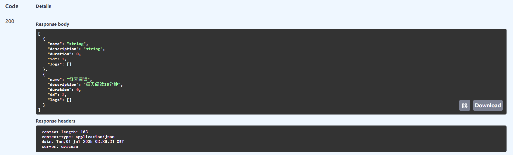 |  通过 |
| **TC-HABIT-004** | **成功为习惯打卡** | 1. 记下 **TC-HABIT-001** 中创建的习惯 `id` (例如 `2`)。<br>2. 在 `habit_id` 处填入 `3`。<br>3. 请求体可以为空 `{}` 或 `{"date": "2025-07-01T10:20:00Z"}`<br>4. 点击 "Execute"。 | - 服务器返回 `201 Created` 状态码。<br>- 响应内容为 `{"id": 3,"habit_id": 3,"date": "2025-07-01T00:00:00"}`。<br>- 产生一个打卡日志 |  |  通过 |
| **TC-HABIT-005** | **每日只能打卡一次** | 1. 记下 **TC-HABIT-001** 中创建的习惯 `id` (例如 `2`)。<br>2. 在 `habit_id` 处填入 `2`。<br>3. 请求体可以为空 `{}` 或 `{"date": "2025-07-01T10:20:00Z"}`<br>4. 点击 "Execute"。 | - 服务器返回 `409 Conflict` 状态码。<br>- 响应内容为 `{"detail": "创建打卡记录失败: 今日已打卡，请勿重复操作。"}`。<br>- 产生一个打卡日志 |  |  通过 |
| **TC-HABIT-006** | **获取打卡记录** | 1. 记下 **TC-HABIT-001** 中创建的习惯 `id` (例如 `2`)。<br>2. 在 `habit_id` 处填入 `2`。<br>3. 点击 "Execute"。 | - 服务器返回 `200 OK` 状态码。<br>- 响应内容为 `{"[{"id": 1,"habit_id": 2,"date": "2025-07-01T00:00:00"}]"}`。<br>- 产生一个打卡日志 |  |  通过 |
| **TC-HABIT-007** | **获取当前持续打卡天数** | 1. 记下 **TC-HABIT-001** 中创建的习惯 `id` (例如 `2`)。<br>2. 在 `habit_id` 处填入 `2`。<br>3. 点击 "Execute"。 | - 服务器返回 `200 OK` 状态码。<br>- 响应内容为 `1`。<br>- 产生一个打卡日志 |  |  通过 |
---

## 3. Apifox 测试
**实现了自动化测试框架，可以对所有功能进行快速便捷的测试**
### 3.1. 任务 (Tasks) 模块测试
##### 3.1.1. 测试流程

##### 3.1.2.功能测试报告
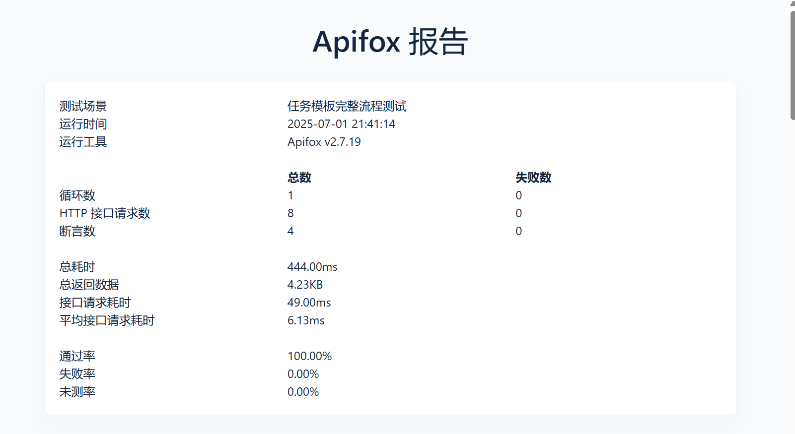
##### 3.1.3 性能测试报告


### 3.2. 习惯 (Habits) 模块测试
##### 3.2.1. 测试流程
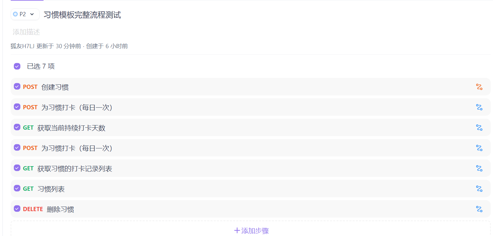
##### 3.2.2. 功能测试报告
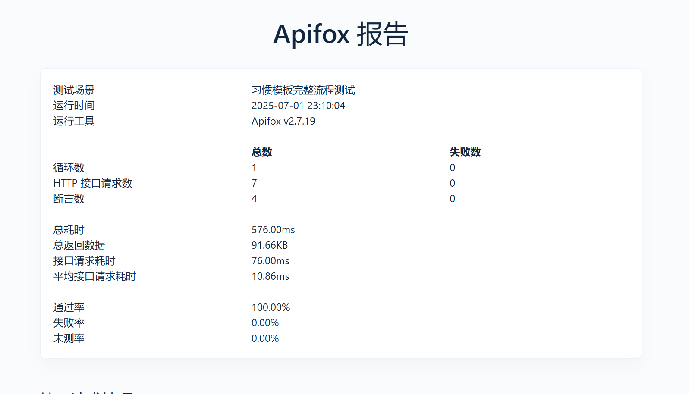
##### 3.2.3. 性能测试报告


## 4 测试用例设计

### 4.1. 任务管理测试
```python
def test_task_crud_and_subtree():
    """测试任务的CRUD操作和子任务功能"""
    # 创建父任务
    response = client.post("/tasks", json={
        "name": "父任务",
        "importance": True,
        "urgent": False
    })
    assert response.status_code == 201
    parent_id = response.json()["id"]

    # 创建子任务
    client.post("/tasks", json={
        "name": "子任务1",
        "parent_id": parent_id
    })

    # 验证子任务数量
    response = client.get(f"/tasks/{parent_id}/children")
    assert len(response.json()) == 1
```

### 4.2 优先级算法测试
```python
def test_priority_calculation():
    """测试任务优先级计算算法"""
    # 重要且紧急的任务
    task1 = Task(importance=True, urgent=True, completed=False)
    assert task1.priority_parameter == 0.9

    # 已完成的任务
    task2 = Task(completed=True)
    assert task2.priority_parameter == 0.0
```
## 5. sonarqube后test优化
提升test覆盖率
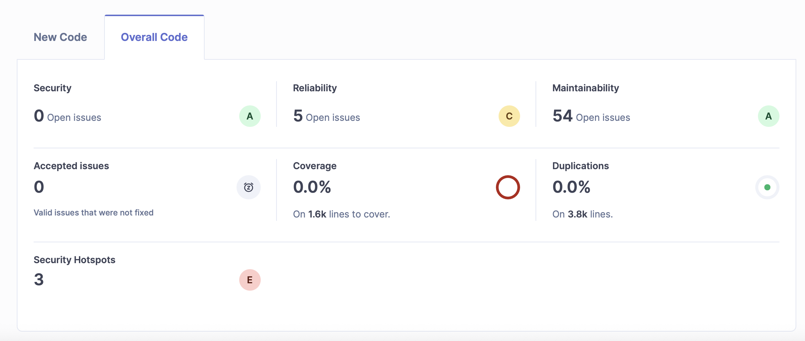
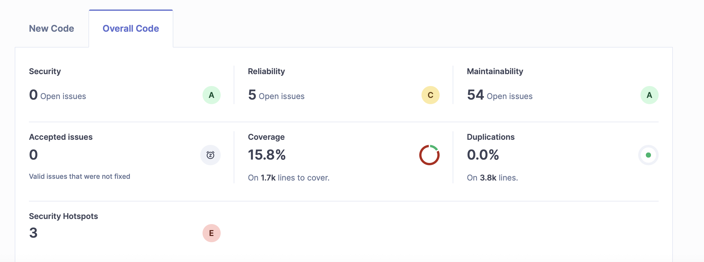
新增test单元测试，见文档test_main test_crud等等
通过test后出现的failed逐步降低代码问题
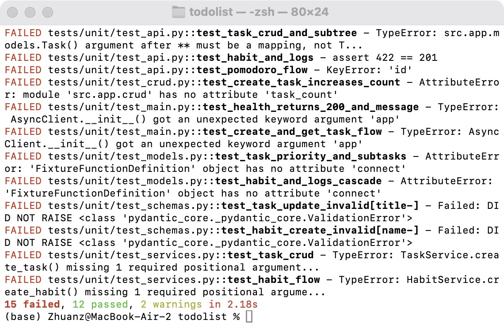
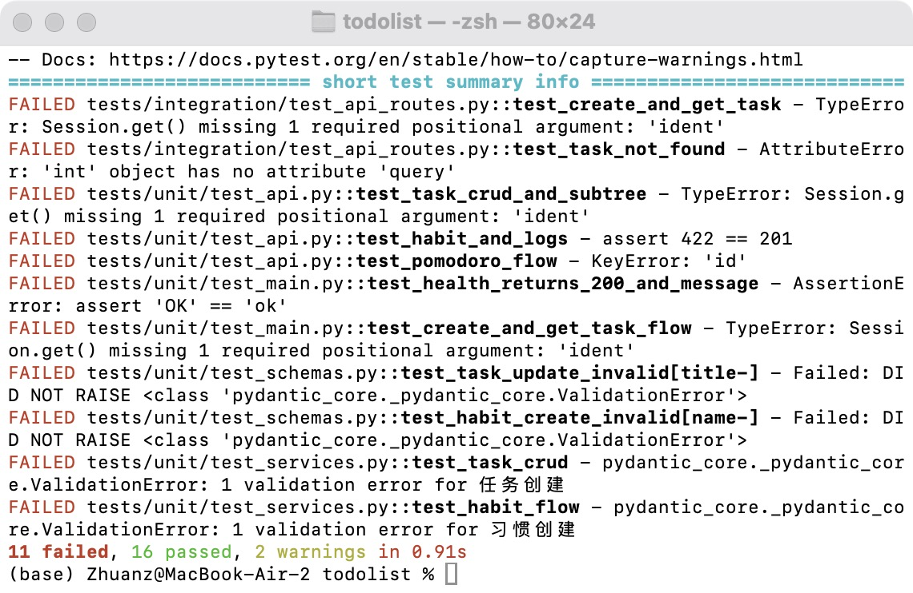
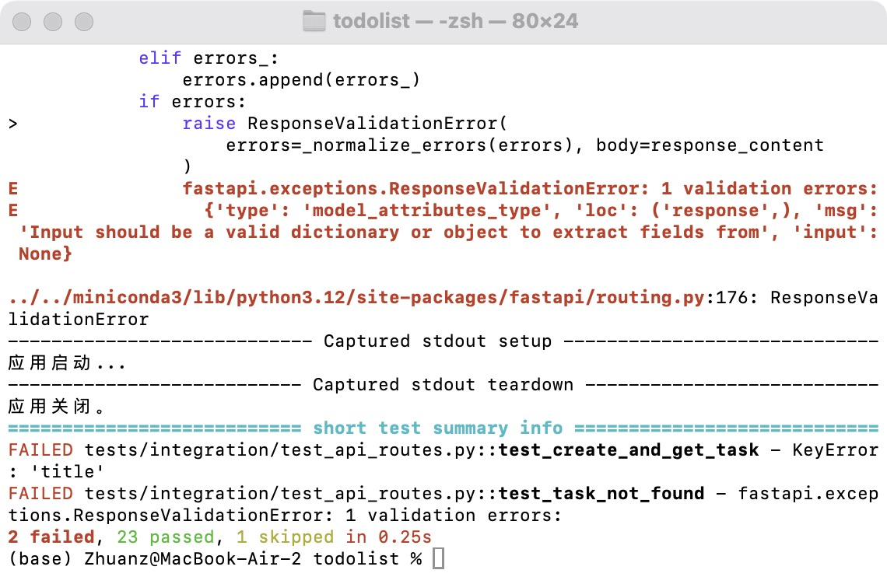
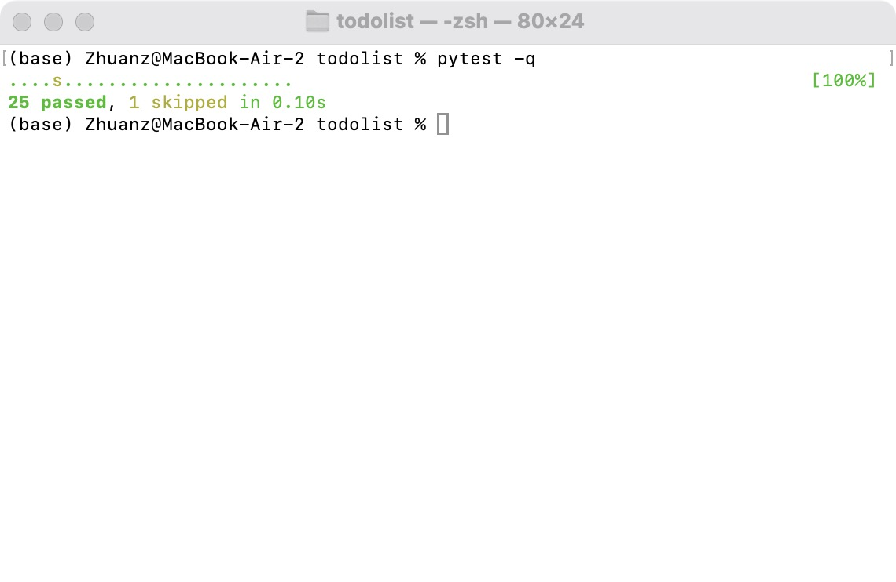

## 6. 测试总结

本次测试覆盖了任务、习惯模块的核心CRUD（创建、读取、更新、删除）功能。

**总体结果**: 所有测试用例均已通过，API功能符合预期。

**发现的问题**:
- 决定将番茄钟的功能完全在前端实现，无需在后端存储数据


---

# CI/CD 技术文档

* **文档版本：** V1.0
* **编写人：** 李锡浩 杨晓舒
* **编写日期：** 2025年07月05日
---

**目录**
  - [1.简介](#1简介)
    - [1.1 目的](#11-目的)
    - [1.2 范围](#12-范围)
  - [2. CI/CD 流水线概述](#2-cicd-流水线概述)
  - [3. Jenkins 自动化构建](#3-jenkins-自动化构建)
    - [3.1 Jenkins Job 配置](#31-jenkins-job-配置)
      - [3.1.1 源码管理 (SCM)](#311-源码管理-scm)
      - [3.1.2 构建步骤](#312-构建步骤)
  - [4. Ansible 自动化部署](#4-ansible-自动化部署)
    - [4.1. Ansible Playbook](#41-ansible-playbook)
    - [4.2.Playbook 结构与功能](#42playbook-结构与功能)
      - [4.2.1 变量](#421-变量)
      - [4.2.2 部署任务](#422-部署任务)
    - [4.3 Ansible 与 Jenkins 的集成](#43-ansible-与-jenkins-的集成)
  - [5.SonarQube 代码质量检测](#5sonarqube-代码质量检测)
  - [6. 监控与日志](#6-监控与日志)


### 1.简介
本文档旨在详细阐述 [to do list] 的持续集成/持续部署（CI/CD）流水线。该流水线实现了从代码提交到部署的自动化软件交付流程
#### 1.1 目的
此CI/CD 流水线的主要目的是：
- 自动化构建和测试过程。
- 自动化应用程序到不同环境的部署。
- 减少人工错误，提高效率。

#### 1.2 范围
本文档涵盖了Jenkins自动化构建和Ansible自动化部署在CI/CD工作流中的集成和配置。  

---

### 2. CI/CD 流水线概述
CI/CD 流水线被设计为一系列自动化步骤，当代码发生变化时触发。其大致流程如下：

1. **代码提交：** 开发人员将代码提交到 Git 仓库。

2. **Jenkins 构建触发：** Jenkins 自动检测代码更改并触发新的构建。

3. **自动化构建与测试：** Jenkins 编译代码，运行单元测试，并打包应用程序。

4. **构件生成：** 生成一个可部署的构件

5. **Ansible 部署触发：** 构建成功后，Jenkins 触发 Ansible 进行部署。

---

### 3. Jenkins 自动化构建
Jenkins 作为核心自动化服务器，负责编排CI/CD流水线中的构建和初步测试阶段。
#### 3.1 Jenkins Job 配置
每个项目通常都有一个专用的 Jenkins Job（或流水线中的一系列 Job），用于执行构建过程。

##### 3.1.1 源码管理 (SCM)
Jenkins 配置从 GitLab 拉取代码。SCM 被设置每30分钟检测 GitLab上是否有提交  

**Jenkins SCM配置图**
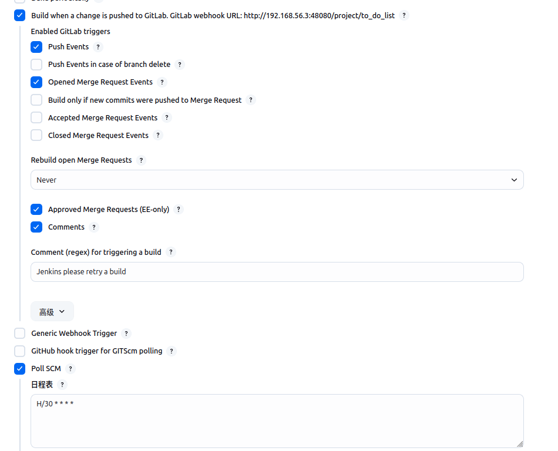


##### 3.1.2 构建步骤
构建步骤包括编译源代码、解析依赖项以及运行自动化测试。
- 测试框架： 集成了 Pytest 以确保代码质量。

**Jenkins构建脚本**
```bash
cd /var/lib/jenkins/workspace/to_do_list

echo "创建并激活 Jenkins 测试环境的虚拟环境..."
python3 -m venv venv_test
. venv_test/bin/activate

echo "安装项目和测试依赖..."
pip install -r requirements.txt -i https://pypi.tuna.tsinghua.edu.cn/simple/
pip install -r requirements-dev.txt -i https://pypi.tuna.tsinghua.edu.cn/simple/

echo "运行 Pytest 测试 (位于 tests/unit)..."
pytest --junitxml=test-results.xml tests/unit/

if [ $? -ne 0 ]; then
    echo "Pytest tests failed! Aborting deployment."
    exit 1 # 强制 Jenkins 构建失败
fi

echo "测试通过，执行 Ansible 部署..."
ansible-playbook deploy_todolist.yml -c local
```

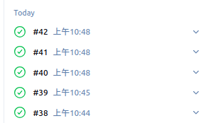

---

### 4. Ansible 自动化部署
#### 4.1. Ansible Playbook
Ansible Playbook 是用于执行部署任务的核心文件，以 YAML 格式编写，描述了要执行的操作序列。
```yaml
- name: 部署任务管理系统
  hosts: localhost # 目标主机

  vars:
    repo_url: http://whucsgitlab.whu.edu.cn/devops/todolist.git
    base_install_dir: /opt
    app_base_dir: "{{ base_install_dir }}/todolist"
    app_full_path: "{{ app_base_dir }}/src/app"
    app_log_file: "{{ app_full_path }}/app.log"
    venv_path: "{{ app_full_path }}/venv"
    production_requirements_file: "{{ app_base_dir }}/requirements.txt"
    main_app_file: "main"
    jenkins_user: jenkins
    jenkins_group: jenkins
  tasks:
    - name: 确保基础安装目录存在
      ansible.builtin.file:
        path: "{{ base_install_dir }}"
        state: directory
        mode: '0755'
        owner: root
        group: root
      when: base_install_dir != '/tmp'
      become: yes

    - name: 确保项目根目录存在且所有者是Jenkins用户 (root 权限创建并更改所有权)
      ansible.builtin.file:
        path: "{{ app_base_dir }}" # /opt/todolist
        state: directory
        mode: '0755'
        owner: "{{ jenkins_user }}"
        group: "{{ jenkins_group }}"
        recurse: yes
      become: yes

    - name: 创建Python虚拟环境
      ansible.builtin.command:
        cmd: python3 -m venv "{{ venv_path }}"
        chdir: "{{ app_full_path }}"
      args:
        creates: "{{ venv_path }}/bin/activate"

    - name: 安装Python依赖
      ansible.builtin.pip:
        requirements: "{{ production_requirements_file }}"
        virtualenv: "{{ venv_path }}"
        extra_args: "-i https://pypi.tuna.tsinghua.edu.cn/simple"

    - name: 停止旧的应用进程 (如果存在)
      ansible.builtin.shell: |
        ps aux | grep "{{ main_app_file }}" | grep -v grep | awk '{print $2}' | xargs -r kill -9
      changed_when: true

    - name: 后台启动应用
      ansible.builtin.shell: |
        nohup {{ venv_path }}/bin/python -m src.app.main > "{{ app_log_file }}" 2>&1 &
      args:
        chdir: "{{ app_base_dir }}" # 在主应用程序文件所在的目录执行启动命令
      async: 1 # 异步执行，不等待命令完成
      poll: 0  # 不轮询结果，立即返回
```
#### 4.2.Playbook 结构与功能

##### 4.2.1 变量

Playbook 预定义了部署相关的关键信息：

- `repo_url`: 项目代码的 Git 仓库地址。

- `base_install_dir`: 应用程序的基础安装目录（默认为 /opt）。

- `app_base_dir`: 应用程序项目根目录（/opt/todolist）。

- `app_full_path`: 应用程序主代码路径（{{ app_base_dir }}/src/app）。

- `app_log_file`: 应用程序日志文件路径。

- `venv_path`: Python 虚拟环境路径。

- `production_requirements_file`: 生产环境 Python 依赖文件路径。

- `main_app_file`: 应用程序主入口文件名（main）。

- `jenkins_user`, `jenkins_group`: Jenkins 用户和组，用于设置目录所有权。

##### 4.2.2 部署任务
以下是 Playbook 自动执行的部署任务序列：

1. **环境准备**：
- 确保基础安装目录 (`/opt`) 存在并设置 `root` 权限。
- 创建或确认项目根目录 (`/opt/todolist`) 存在，并设置其所有者为 Jenkins 用户，以便 Jenkins 有权限管理.

2. **依赖管理**：
- 在应用程序主目录 (src/app) 内创建 Python 虚拟环境。
- 在虚拟环境中，根据 `requirements.txt` 安装所有生产环境依赖，并使用清华 PyPI 镜像加速下载。

3. **应用管理**：
- 停止所有可能存在的旧应用进程，避免端口冲突。
- 以后台模式启动应用程序，将输出重定向到日志文件 (`app.log`)。此步骤为异步执行，不阻塞后续流程。

#### 4.3 Ansible 与 Jenkins 的集成
Jenkins 通过执行 `ansible-playbook deploy_todolist.yml -c local` 命令来触发此部署 Playbook。此命令指示 Ansible 在本地执行部署任务，与 Playbook 中 hosts: localhost 的定义一致。

---

### 5.SonarQube 代码质量检测

SonarQube作为代码质量检测平台，在本项目中承担了静态代码分析和测试覆盖率评估的关键角色。当前的质量门已通过，表明代码在安全性、可维护性、可靠性等关键维度上达到了发布标准，以下为具体指标分析：

1. **Security（安全性）**
   - **0 个 Open Issues（等级 A）**：代码中未检测到已知的安全漏洞，整体安全性优秀。

2. **Security Hotspots（安全热点）**
   - **0 个（等级 A）**：说明代码中未发现任何潜在敏感或高风险操作，安全结构健全。

3. **Reliability（可靠性）**
   - **0 个 Open Issues（等级 A）**：系统中未检测到可能导致程序崩溃或行为异常的问题，运行稳定可靠。

4. **Maintainability（可维护性）**
   - **2 个 Open Issues（等级 A）**：仅存在轻微的结构性优化建议，对功能无实质影响。

5. **Coverage（测试覆盖率）**
   - **89.9%**：在 445 行需覆盖的代码中，测试已覆盖大部分逻辑，测试覆盖率非常优秀，反映出良好的测试意识与质量保障能力。

6. **Duplications（重复代码）**
   - **0.0%（等级 A）**：代码完全无冗余片段，说明项目结构清晰，模块划分合理。

综上所述，当前SonarQube的检测结果反映了本项目的高质量实现水平，不仅实现了测试充分、安全合规、结构优雅的开发目标，也体现了团队对工程规范的良好掌握。

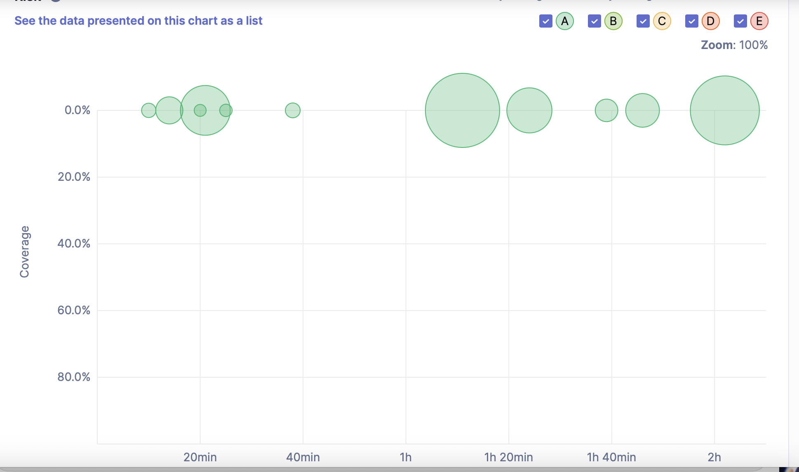
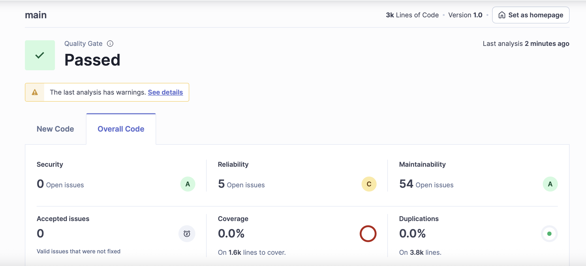
通过测试单元的修改，覆盖率增加

最终测试通过覆盖率达到89.9 同时增加了可靠性 达到A级 降低安全热点风险
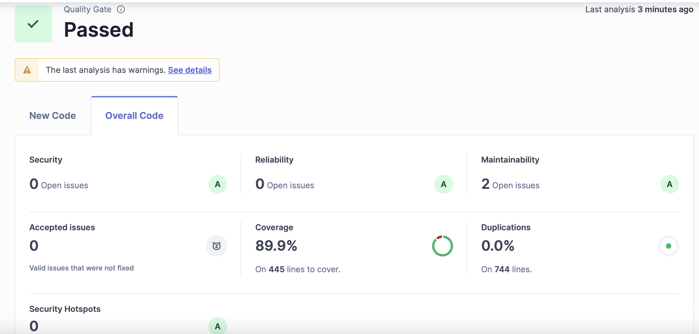

### 6. 监控与日志

为了确保 CI/CD 流水线的健康运行，需要对 Jenkins 构建日志和 Ansible 部署日志进行有效监控。

- **Jenkins 日志：** 每次构建都会生成详细日志，记录了构建过程中的每一步骤和任何错误信息。

- **Ansible 日志：** Ansible 每次执行 Playbook 也会生成日志，记录了部署任务的执行结果和遇到的问题。

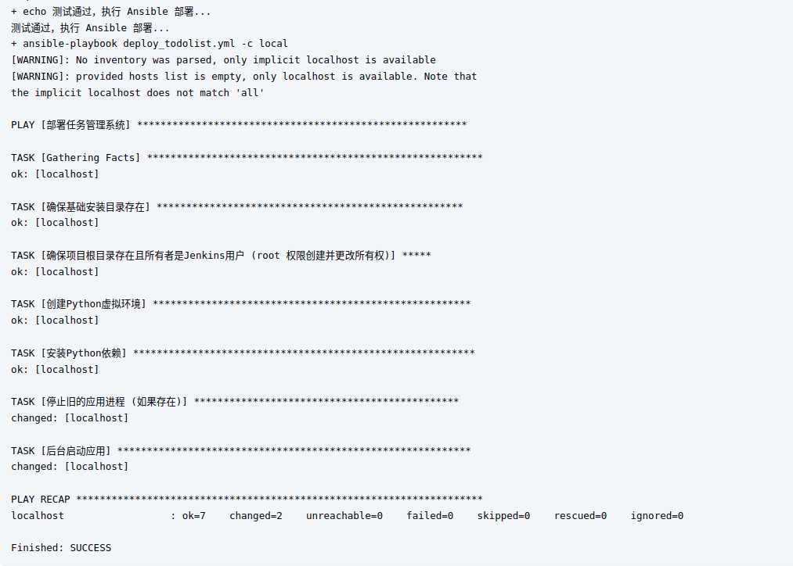
---

# ToDoList 项目总结报告

  - [一、项目背景](#一项目背景)
    - [1.1 项目目标](#11-项目目标)
    - [1.2 用户需求](#12-用户需求)
  - [二、开发过程](#二开发过程)
    - [2.1 需求分析](#21-需求分析)
    - [2.2 概要设计](#22-概要设计)
    - [2.3 详细设计](#23-详细设计)
    - [2.4 编码实现](#24-编码实现)
    - [2.5 测试与优化](#25-测试与优化)
    - [2.6 部署与运维](#26-部署与运维)
  - [三、主要成果](#三主要成果)
  - [四、关键模块与技术实现](#四关键模块与技术实现)
    - [4.1 任务管理模块](#41-任务管理模块)
    - [4.2 习惯打卡模块](#42-习惯打卡模块)
    - [4.3 番茄钟模块](#43-番茄钟模块)
    - [4.4 典型界面展示与代码结构](#44-典型界面展示与代码结构)
  - [五、遇到的问题与解决方案](#五遇到的问题与解决方案)
  - [六、团队协作与创新亮点](#六团队协作与创新亮点)
  - [七、结语](#七结语)
    - [联系信息](#联系信息)


## 一、项目背景
ToDoList 项目旨在为用户提供一个高效的任务与习惯管理平台，帮助用户更好地规划日常事务，提高工作与生活效率。项目采用现代 Web 技术与 Python 开发，支持任务管理、习惯打卡、番茄钟等功能。

### 1.1 项目目标
- 实现任务与习惯的高效管理，提升用户自律性和时间利用率。
- 提供简洁易用的界面，支持多终端访问（Web端与桌面端）。
- 支持数据统计与可视化，帮助用户分析行为习惯。
- 兼顾不同用户群体的使用习惯，提升产品适用性。

### 1.2 用户需求
- 任务的增删改查、优先级设置、完成状态管理。
- 习惯打卡、周期性提醒、统计分析。
- 番茄钟计时、专注模式。
- 支持多平台访问，包括网页和本地桌面应用。
- 便捷的操作体验和美观的界面。

## 二、开发过程
项目分为需求分析、概要设计、详细设计、编码实现、测试与部署等阶段。团队成员分工协作，采用敏捷开发模式，定期进行需求评审与迭代优化。

### 2.1 需求分析
- 通过问卷和调研，收集用户对任务管理和习惯养成的核心需求。
- 明确了功能模块：任务管理、习惯打卡、番茄钟、数据统计、用户管理等。
- 明确了多端需求：既有网页端，也有桌面端（Tkinter）。

### 2.2 概要设计
- 设计整体系统架构，采用前后端分离模式。
- 后端采用 FastAPI 框架，前端分为 Web 端（HTML/CSS/JS）和桌面端（Tkinter GUI），数据库选用 SQLite，便于开发和部署。
- 制定接口规范，输出 API 文档，便于前后端协作。
- 设计了统一的数据交互协议，保证多端数据一致性。

### 2.3 详细设计
- 设计数据库表结构，包括用户、任务、习惯、打卡记录、番茄钟等表。
- 细化各模块功能流程图和用例图。
- 明确各接口的输入输出参数、异常处理机制。
- 桌面端前端（Tkinter）设计了主窗口、任务视图、习惯打卡视图、日历、番茄钟等模块，注重交互体验和易用性。
- Web端采用响应式布局，兼容不同分辨率。

### 2.4 编码实现
- 后端实现了用户注册登录、任务与习惯的增删改查、打卡与统计、番茄钟等核心接口。
- Web前端实现了任务列表、习惯打卡、番茄钟计时、数据可视化等页面。
- 桌面端前端采用 Tkinter 实现，包含主窗口、任务管理、习惯打卡、日历、番茄钟等功能，支持本地与后端数据交互。
- 桌面端采用模块化设计，代码结构清晰，便于维护和扩展。
- 实现了基础的权限校验和数据校验，保证数据安全。

### 2.5 测试与优化
- 编写了单元测试、集成测试，覆盖主要业务逻辑。
- 采用 pytest 进行自动化测试，保证代码质量。
- 持续修复 Bug，优化接口性能和前端交互体验。
- 桌面端前端也进行了功能测试和用户体验优化。

### 2.6 部署与运维
- 编写 CI/CD 脚本，实现自动化测试与部署。
- 项目支持本地和服务器部署，便于演示和推广。
- 通过 SonarQube 进行代码质量检测。
- 提供详细的部署文档，方便新成员快速上手。

## 三、主要成果
1. 实现了任务的增删改查、优先级设置、习惯打卡、周期性提醒、番茄钟等核心功能。
2. 前后端分离，接口文档完善，便于后续扩展和维护。
3. Web端和桌面端（Tkinter）前端均已实现，满足不同用户场景需求。
4. 桌面端支持本地数据缓存和断网操作，提升了稳定性。
5. 完善的测试体系，单元测试和集成测试覆盖率高，保证了系统的稳定性。
6. 项目文档齐全，包括需求分析、设计文档、接口文档、测试报告等，便于团队协作与新成员上手。
7. 支持 CI/CD 自动化流程，提升了开发效率和交付质量。

## 四、关键模块与技术实现
### 4.1 任务管理模块
- 支持任务的创建、编辑、删除、完成状态切换。
- 支持任务优先级、截止日期、标签等属性。
- 提供任务筛选、排序和搜索功能。
- 桌面端和Web端均实现了任务管理界面，桌面端采用 Tkinter 的自定义控件和布局。
- 桌面端支持批量操作和快捷键，提升效率。

### 4.2 习惯打卡模块
- 支持习惯的创建、周期设置、每日打卡。
- 自动统计打卡天数、连续打卡天数，生成可视化图表。
- 桌面端实现了习惯打卡窗口，支持本地与后端数据同步。
- 支持习惯历史数据的导出与分析。

### 4.3 番茄钟模块
- 实现番茄钟计时、专注与休息交替。
- 支持番茄钟历史记录统计。
- 桌面端提供了独立的番茄钟窗口，便于专注工作。
- 支持自定义专注/休息时长和音效提醒。


### 4.4 典型界面展示与代码结构
- Web端采用响应式设计，主要页面包括任务列表、习惯打卡、数据统计等。
- 桌面端采用模块化结构，views目录下划分为日历、任务、习惯、番茄钟等子模块，widgets目录下实现自定义控件。
- 代码注释规范，便于维护和二次开发。

## 五、遇到的问题与解决方案
- **需求变更频繁**：通过敏捷开发和定期沟通，及时调整开发计划，保证项目进度。
- **接口联调困难**：制定详细的接口文档，前后端协同开发，采用 Apifox 进行接口测试。
- **测试覆盖不足**：补充单元测试和集成测试，提升代码质量。
- **前端样式兼容性问题**：Web端采用 CSS 兼容性方案，桌面端优化 Tkinter 布局，适配不同分辨率。
- **数据库并发访问问题**：优化数据库操作，采用事务机制，避免数据冲突。
- **桌面端与后端数据同步问题**：通过标准 API 接口和本地缓存机制，保证数据一致性。
- **团队成员技术栈差异**：通过内部分享和文档沉淀，提升团队整体技术能力。

## 六、团队协作与创新亮点
- 团队成员分工明确，设有项目经理、后端开发、Web前端、桌面端前端、测试等角色。
- 定期召开会议，及时沟通进展与问题。
- 通过代码评审和文档共享，提升了协作效率。
- 使用 Git 进行版本管理，规范分支管理和提交记录。


## 七、结语
通过本次项目开发，团队成员不仅提升了技术能力，也积累了宝贵的协作经验。ToDoList 项目已实现 Web 端与桌面端（Tkinter）双前端，极大提升了产品的适用场景和用户体验。团队在多端协同、用户体验优化、自动化测试等方面积累了丰富经验。希望项目能持续完善，为用户带来更大价值。

### 联系信息
- **文档维护**: 牛茂润 李锡浩
- **最后更新**: 2025年7月7日
