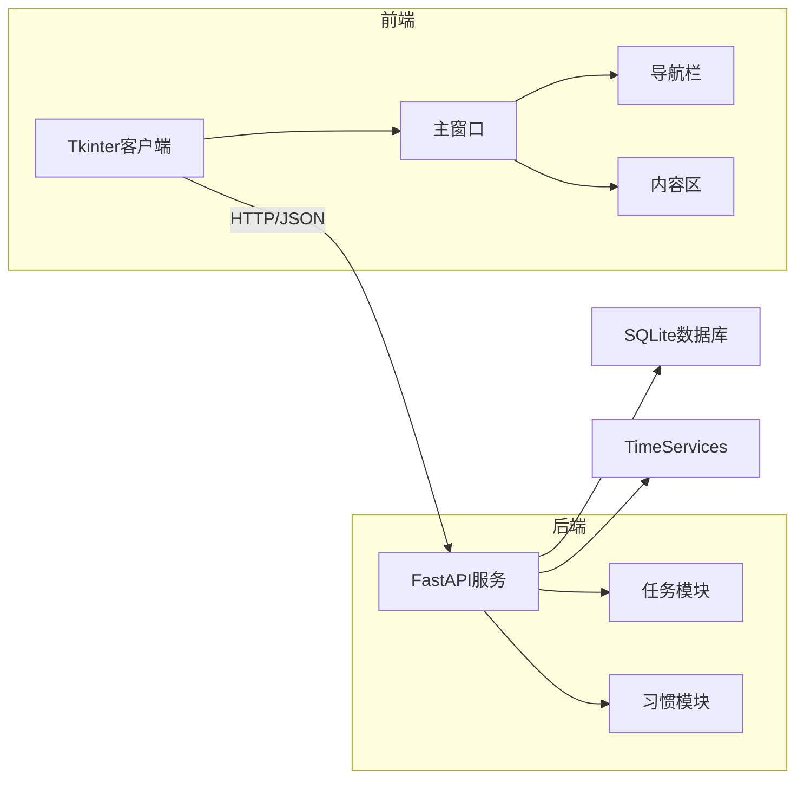
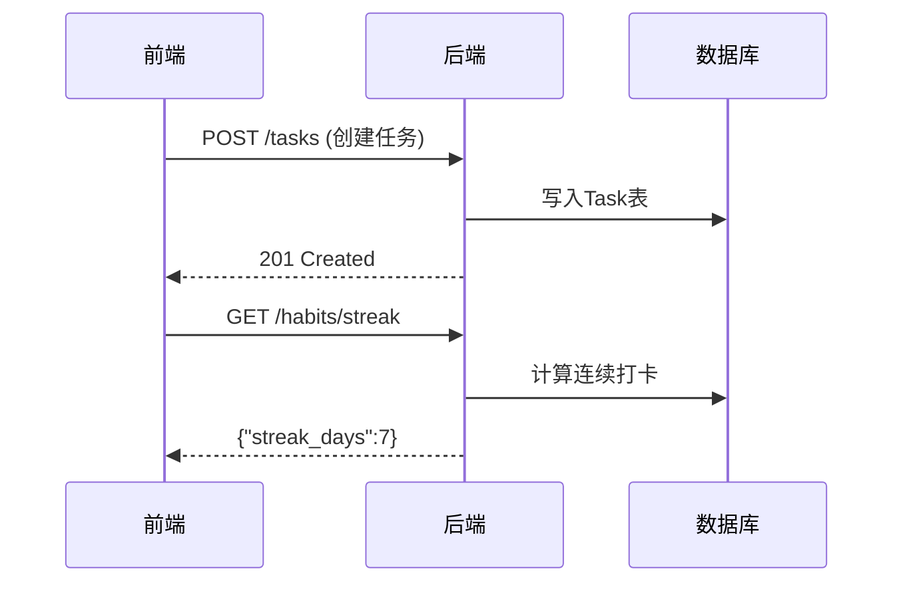
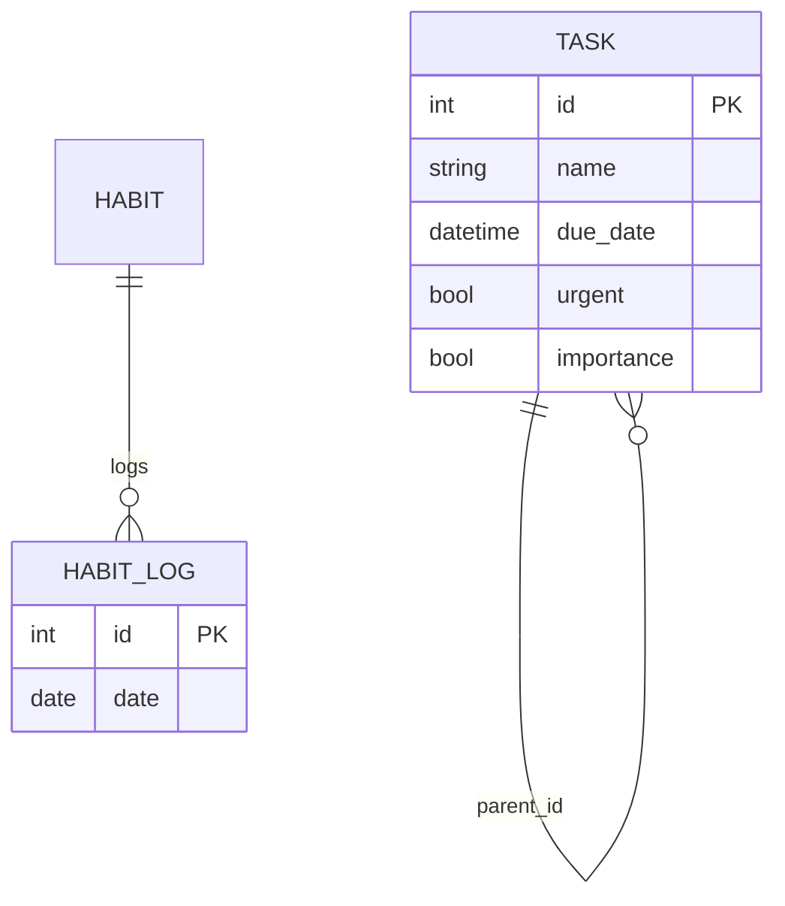


# Todo-List 概要设计文档


**文档版本：** V1.0  
**编写人：** 顾晨昊  
**编写日期：** 2025年07月05日  
**最后修订日期：** 2025年07月05日  

---
**目录**
- [Todo-List 概要设计文档](#todo-list-概要设计文档)
    - [1. 引言](#1-引言)
      - [1.1. 文档目的](#11-文档目的)
      - [1.2. 范围](#12-范围)
      - [1.3. 读者对象](#13-读者对象)
      - [1.4. 术语与缩略语](#14-术语与缩略语)
      - [1.5. 参考文档](#15-参考文档)
    - [2. 系统架构概述](#2-系统架构概述)
      - [2.1. 架构风格选择](#21-架构风格选择)
      - [2.2. 整体架构图](#22-整体架构图)
      - [2.3. 架构组件描述](#23-架构组件描述)
    - [3. 模块设计](#3-模块设计)
      - [3.1. 模块划分](#31-模块划分)
      - [3.2. 模块交互流程](#32-模块交互流程)
    - [4. 技术选型](#4-技术选型)
      - [4.1. 前端技术栈](#41-前端技术栈)
      - [4.2. 后端技术栈](#42-后端技术栈)
      - [4.3. 数据存储](#43-数据存储)
    - [5. 关键设计](#5-关键设计)
      - [5.1. 任务优先级算法](#51-任务优先级算法)
      - [5.2. 连续打卡统计](#52-连续打卡统计)
    - [6. 部署方案](#6-部署方案)
      - [6.1. 开发环境](#61-开发环境)
      - [6.2. 生产部署](#62-生产部署)
    - [7. 附录](#7-附录)
      - [7.1. 代码结构](#71-代码结构)
      - [7.2 风险清单](#72-风险清单)

### 1. 引言

#### 1.1. 文档目的
本文档定义基于Tkinter+FastAPI的Todo-List系统架构设计，涵盖任务管理、习惯追踪两大核心模块，作为开发基准规范。
#### 1.2. 范围

* **任务管理：增删改查、子任务、优先级计算**
* **习惯管理：打卡记录、连续天数统计**

#### 1.3. 读者对象
*   后端开发人员
*   前端联调人员
*   项目测试人员

#### 1.4. 术语与缩略语
| 术语/缩略语 | 解释 |
| :---------- | :--- |
| FastAPI     | 用于构建API的Python框架 |
| SQLAlchemy  | Python ORM工具 |
| Tkinter     | Python标准GUI库 |

#### 1.5. 参考文档
*   [需求分析文档](需求分析.md)
*   [FastAPI官方文档](https://fastapi.tiangolo.com/)

### 2. 系统架构概述

#### 2.1. 架构风格选择
* **三层架构**：    
   * 前端：Tkinter桌面应用
   * 后端：FastAPI微服务  
   * 数据层：SQLite+SQLAlchemy
* **理由**：代码结构清晰，适合快速迭代的中小型项目。


#### 2.2. 整体架构图

#### 2.3. 架构组件描述

| 组件类型 | 实现类/文件 | 职责 |
|----------|-------------|------|
| 前端框架 | main_window.py	 | 窗口主控/拖动逻辑 |
| 视图模块 | home.py/habitclockin.py | RESTful端点定义 |
| API服务  | tasks.py/habits.py	 | 数据统计分析 | 
| 业务逻辑 | services.py | 核心算法（如优先级计算） | 
| 数据持久化 | models.py/crud.py | 数据库模型与操作封装 | 


### 3. 模块设计

#### 3.1. 模块划分
| 模块名称 | 对应代码文件 | 核心功能 |
|----------|--------------|----------|
| 主窗口框架 | main_window.py	 | 基础窗口管理/导航控制 |
| 任务管理	 | home.py/services.py | 任务增删改查/树形展示 |
| 习惯追踪	 | habitclockin.py		 | 打卡记录管理/连续天数统计 | 
| 时间服务	 | services.py(TimeServices) | 日期计算/格式化 | 

#### 3.2. 模块交互流程


### 4. 技术选型

#### 4.1. 前端技术栈
| 技术 | 版本 | 选用理由 |
|----------|--------------|----------|
| Tkinter | Python内置 | 零依赖/快速原型开发 |
| ttk组件库 |  | 现代化样式支持 |

#### 4.2. 后端技术栈
|   技术   |     版本     | 关键特性 |
|----------|--------------|----------|
| FastAPI | 0.95+ | 自动API文档/异步支持 |
| Pydantic | 2.0+ | 强类型数据验证 |
| Uvicorn | 0.22+ | ASGI服务器 | 

#### 4.3. 数据存储



### 5. 关键设计

#### 5.1. 任务优先级算法

```python
# models.py

@property
def priority_parameter(self):
    return (self.importance * 0.45 + 
            self.urgent * 0.45 + 
            self._due_date_weight * 0.1)

```            

#### 5.2. 连续打卡统计
```python
# services.py

def get_habit_streak():
    current_date = date.today()
    while current_date in log_dates:
        streak += 1
        current_date -= timedelta(days=1)

```

### 6. 部署方案

#### 6.1. 开发环境

```python
# 后端启动
uvicorn main:app --reload

# 前端启动
python main_window.py

```

#### 6.2. 生产部署
|   组件   |   方案   |
|----------|----------|
| 前端 | PyInstaller打包exe | 
| 后端 | Docker容器+Nginx反向代理 |
| 数据库 | PostgreSQL主从集群 |


### 7. 附录

#### 7.1. 代码结构
```
.
├── app/ (backend)
│   ├── routers/
│   │   ├── habits.py
│   │   ├── tasks.py
│   │   └── __init__.py
│   ├── crud.py        
│   ├── db.py          
│   ├── main.py        
│   ├── models.py      
│   ├── schemas.py     
│   ├── services.py    
│   └── __init__.py
└── gui/ (frontend)
    ├── views/
    │   ├── calendar.py
    │   ├── habitclockin.py
    │   ├── home.py
    │   ├── timer.py
    │   └── __init__.py
    ├── widgets/
    │   ├── content_bar.py
    │   ├── navigation_bar.py
    │   ├── title_bar.py
    │   └── __init__.py
    ├── main_window.py  
    ├── services.py    
    ├── utils.py        
    ├── README.md
    └── __init__.py
```

#### 7.2 风险清单
|   风险项   |  应对措施  |
|------------|------------|
| Tkinter性能限制 | 复杂组件虚拟化渲染 | 
| SQLite并发能力 | 迁移至PostgreSQL |


---


