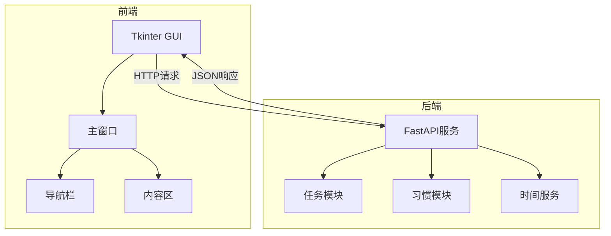
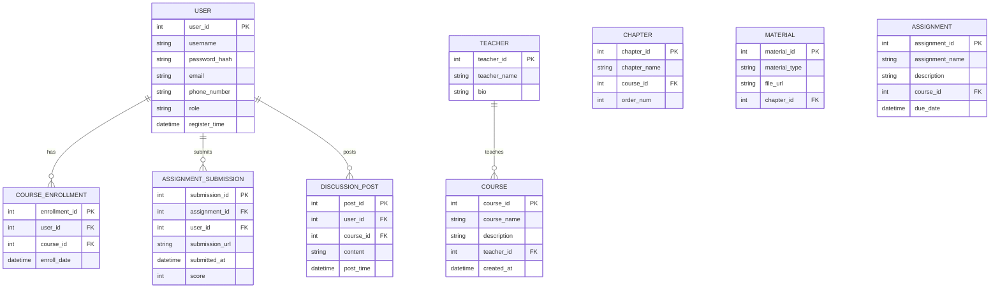

# **Todo-List 概要设计文档**

**文档版本：** V1.0
**编写人：** 顾晨昊
**编写日期：** 2025年07月05日
**最后修订日期：** 2025年07月05日

---

**目录**

1.  引言
    1.1. 文档目的
    1.2. 范围
    1.3. 读者对象
    1.4. 术语与缩略语
    1.5. 参考文档
2.  系统架构概述
    2.1. 架构风格选择
    2.2. 整体架构图
    2.3. 架构组件描述
3.  模块设计
    3.1. 模块划分
    3.2. 模块详细描述
        3.2.1. [模块1名称]
        3.2.2. [模块2名称]
        ...
4.  技术选型与理由
    4.1. 前端技术栈
    4.2. 后端技术栈
    4.3. 数据库
    4.4. 其他中间件/服务
    4.5. 开发工具与环境
5.  数据模型设计 (高层)
    5.1. 核心实体关系图 (ERD)
    5.2. 主要数据表/集合描述
6.  部署架构设计
    6.1. 部署拓扑图
    6.2. 部署环境说明
    6.3. 伸缩性与高可用性考虑
7.  安全性设计
    7.1. 认证与授权机制
    7.2. 数据安全
    7.3. 接口安全
8.  性能设计
    8.1. 性能目标回顾
    8.2. 性能优化策略
9.  错误处理与日志策略
    9.1. 错误处理机制
    9.2. 日志记录策略
10. 风险与待定事项
11. 附录
    11.1. 参考文献
    11.2. 术语表

---

**正文**

### **1. 引言**

#### **1.1. 文档目的**
本文档定义基于Tkinter+FastAPI的Todo-List系统架构设计，涵盖任务管理、习惯追踪两大核心模块，作为开发基准规范。
#### **1.2. 范围**

* **任务管理：增删改查、子任务、优先级计算**
* **习惯管理：打卡记录、连续天数统计**

#### **1.3. 读者对象**
*   后端开发人员
*   前端联调人员
*   项目测试人员

#### **1.4. 术语与缩略语**
| 术语/缩略语 | 解释 |
| :---------- | :--- |
| FastAPI     | 用于构建API的Python框架 |
| SQLAlchemy  | Python ORM工具 |
| Tkinter     | Python标准GUI库 |

#### **1.5. 参考文档**
*   [需求分析文档](需求分析.md)
*   [FastAPI官方文档](https://fastapi.tiangolo.com/)

### **2. 系统架构概述**

#### **2.1. 架构风格选择**
* **三层架构**：    
   * 前端：Tkinter桌面应用
   * 后端：FastAPI微服务  
   * 数据层：SQLite+SQLAlchemy
* **理由**：代码结构清晰，适合快速迭代的中小型项目。

#### **2.2. 整体架构图**

#### **2.3. 架构组件描述**

| 组件类型 | 实现类/文件 | 职责 |
|----------|-------------|------|
| 前端框架 | main_window.py	 | 窗口主控/拖动逻辑 |
| 视图模块 | home.py/habitclockin.py | RESTful端点定义 |
| API服务  | tasks.py/habits.py	 | 数据统计分析 | 
| 业务逻辑 | services.py | 核心算法（如优先级计算） | 
| 数据持久化 | models.py/crud.py | 数据库模型与操作封装 | 

### **3. 模块设计**

#### **3.1. 模块划分**
| 模块名称 | 对应代码文件 | 核心功能 |
|----------|--------------|----------|
| 主窗口框架 | main_window.py	 | 基础窗口管理/导航控制 |
| 任务管理	 | home.py/services.py | 任务增删改查/树形展示 |
| 习惯追踪	 | habitclockin.py		 | 打卡记录管理/连续天数统计 | 
| 时间服务	 | services.py(TimeServices) | 日期计算/格式化 | 

#### **3.2. 模块交互流程**

### **4. 技术选型**

#### **4.1. 前端技术栈**
*   **框架：** [例如：React / Vue.js / Angular]
    *   **理由：** [例如：社区活跃，生态丰富，组件化开发，易于学习和使用。]
*   **构建工具：** [例如：Webpack / Vite]
*   **语言：** [例如：JavaScript / TypeScript]
*   **UI库 (可选)：** [例如：Ant Design / Element UI / Material-UI]

#### **4.2. 后端技术栈**
*   **语言：** [例如：Java / Python / Node.js / Go]
    *   **理由：** [例如：Java生态成熟，性能稳定，适合企业级应用；Python开发效率高，库丰富；Node.js适合高并发I/O密集型应用。]
*   **框架：** [例如：Spring Boot (Java) / Django (Python) / Express (Node.js) / Gin (Go)]
    *   **理由：** [例如：Spring Boot约定大于配置，快速开发；Django全栈框架，功能完备；Express轻量灵活。]
*   **API规范：** [例如：RESTful API]

#### **4.3. 数据库**
*   **关系型数据库：** [例如：MySQL / PostgreSQL]
    *   **理由：** [例如：成熟稳定，社区支持好，ACID特性，适合存储结构化数据。]
*   **非关系型数据库 (可选)：** [例如：MongoDB (文档型) / Redis (键值对缓存)]
    *   **理由：** [例如：MongoDB适合存储非结构化数据；Redis高性能缓存，支持多种数据结构。]

#### **4.4. 其他中间件/服务**
*   **消息队列 (可选)：** [例如：RabbitMQ / Kafka]
    *   **理由：** [例如：实现异步通信，解耦服务，削峰填谷。]
*   **文件存储：** [例如：MinIO (私有化部署) / 阿里云OSS / 腾讯云COS]
    *   **理由：** [例如：提供高可用、高扩展的对象存储服务。]
*   **版本控制：** Git (使用GitHub/GitLab/Gitee)

#### **4.5. 开发工具与环境**
*   **IDE：** [例如：IntelliJ IDEA / VS Code / PyCharm]
*   **操作系统：** [例如：Windows / macOS / Linux]
*   **容器化：** Docker
*   **API测试工具：** Postman / Swagger UI

### **5. 数据模型设计 (高层)**

#### **5.1. 核心实体关系图 (ERD)**
[在此处插入高层ERD，展示主要实体及其关系。例如：]

#### **5.2. 主要数据表/集合描述**
[简要描述每个核心实体对应的数据库表或集合，包括其主要字段和用途。]
*   **User (用户表)：** 存储用户基本信息、认证凭证和角色。
*   **Course (课程表)：** 存储课程的基本信息，与教师关联。
*   **Chapter (章节表)：** 存储课程的章节信息，与课程关联。
*   **Material (课件表)：** 存储章节下的具体学习资料（视频、文档等）链接。
*   **CourseEnrollment (选课表)：** 记录用户选修了哪些课程。
*   **Assignment (作业表)：** 存储作业信息。
*   **AssignmentSubmission (作业提交表)：** 记录用户提交作业的情况。
*   **DiscussionPost (讨论帖表)：** 记录用户在课程中的讨论内容。

### **6. 部署架构设计**

#### **6.1. 部署拓扑图**
[在此处插入高层部署拓扑图，展示系统组件如何部署在物理或虚拟服务器上。例如：]

#### **6.2. 部署环境说明**
*   **服务器操作系统：** Linux (CentOS/Ubuntu)
*   **容器化：** 所有服务（前端、后端）都将打包成Docker镜像。
*   **部署方式：**
    *   小型项目：单机部署，使用Docker Compose管理。
    *   大型项目：多机部署，使用Kubernetes或Swarm进行容器编排。
*   **域名与SSL：** 配置域名并启用HTTPS。

#### **6.3. 伸缩性与高可用性考虑**
*   **负载均衡：** 使用Nginx或云服务商的负载均衡器分发请求到多个后端实例。
*   **无状态服务：** 后端服务设计为无状态，便于水平扩展。
*   **数据库高可用：** 考虑主从复制或集群方案（如果项目规模允许）。
*   **缓存：** 使用Redis减轻数据库压力，提高响应速度。
*   **文件存储：** 使用专业的文件存储服务保证高可用和持久性。

### **7. 安全性设计**

#### **7.1. 认证与授权机制**
*   **用户认证：** 采用基于Token的认证机制（如JWT），用户登录成功后颁发Token，后续请求携带Token进行身份验证。
*   **用户授权：** 基于角色的访问控制 (RBAC)，不同角色拥有不同的操作权限。
*   **密码存储：** 密码进行加盐哈希处理后存储。

#### **7.2. 数据安全**
*   **传输加密：** 前后端通信全部采用HTTPS协议。
*   **敏感数据加密：** 数据库中存储的敏感信息（如身份证号、银行卡号等，如果存在）进行加密。
*   **备份与恢复：** 定期进行数据备份，并制定数据恢复策略。

#### **7.3. 接口安全**
*   **输入校验：** 对所有用户输入进行严格的合法性校验，防止SQL注入、XSS等攻击。
*   **限流：** 对高频接口进行限流，防止恶意请求。
*   **日志：** 记录关键操作日志，便于审计和追踪。

### **8. 性能设计**

#### **8.1. 性能目标回顾**
*   **响应时间：** 90%的用户操作应在2秒内完成。
*   **并发用户数：** 支持至少500个并发用户。
*   **吞吐量：** 每秒处理至少100个请求。

#### **8.2. 性能优化策略**
*   **数据库优化：** 合理设计索引、优化SQL查询、读写分离。
*   **缓存机制：** 广泛使用Redis缓存热点数据和查询结果。
*   **异步处理：** 对于耗时操作（如邮件发送、文件处理）采用异步消息队列处理。
*   **前端优化：** 资源压缩、CDN加速、按需加载。
*   **代码优化：** 避免N+1查询、减少不必要的计算。

### **9. 错误处理与日志策略**

#### **9.1. 错误处理机制**
*   **统一异常处理：** 后端服务提供统一的异常处理机制，将异常转换为友好的错误码和错误信息返回给前端。
*   **前端错误提示：** 前端根据后端返回的错误码和信息，向用户展示清晰的错误提示。
*   **重试机制：** 对于可重试的瞬时错误，考虑引入重试机制。

#### **9.2. 日志记录策略**
*   **日志级别：** 区分DEBUG, INFO, WARN, ERROR等日志级别。
*   **日志内容：** 记录请求参数、响应结果、异常堆栈、关键业务流程等。
*   **日志存储：** 将日志输出到文件，并考虑使用ELK Stack (Elasticsearch, Logstash, Kibana) 或其他日志管理系统进行集中收集、存储和分析。
*   **可追溯性：** 在日志中包含请求ID或用户ID，便于追踪请求链路。

### **10. 风险与待定事项**
*   **技术风险：** [例如：对XX新技术掌握不足，可能影响开发进度。]
*   **进度风险：** [例如：需求变更频繁可能导致延期。]
*   **待定事项：** [例如：具体的消息队列选型待进一步调研；是否需要全文搜索功能待定。]

### **11. 附录**

#### **11.1. 参考文献**
*   [如果参考了其他架构模式、设计原则等，请列出。]

#### **11.2. 术语表**
[与1.4节类似，但可以更详细地列出文档中所有可能引起歧义的术语及其定义。]

---

