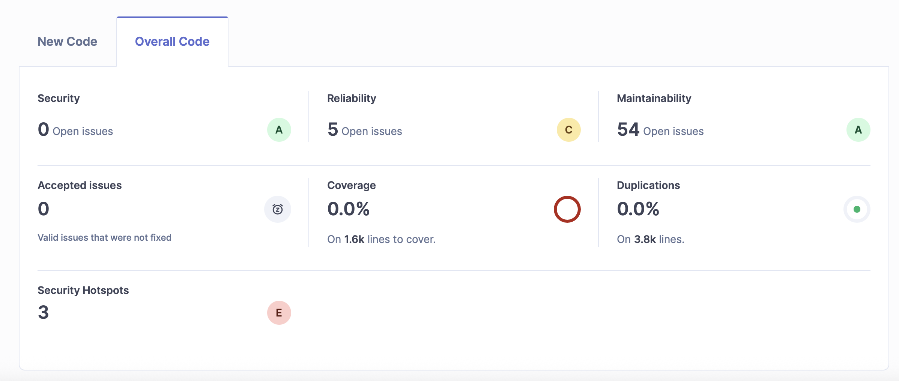
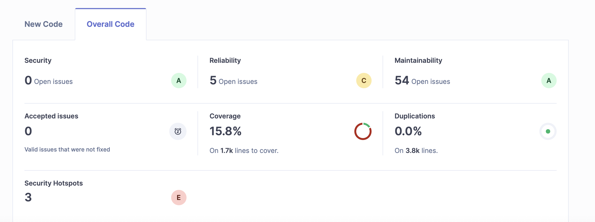
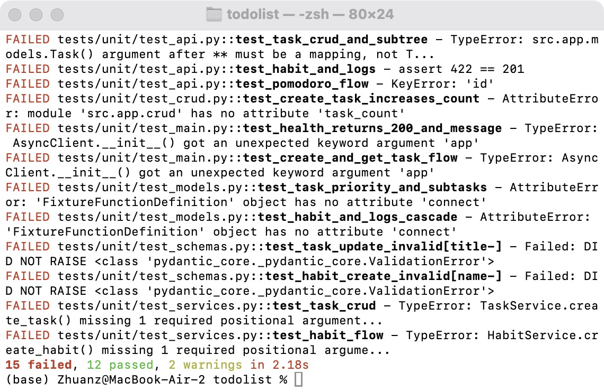
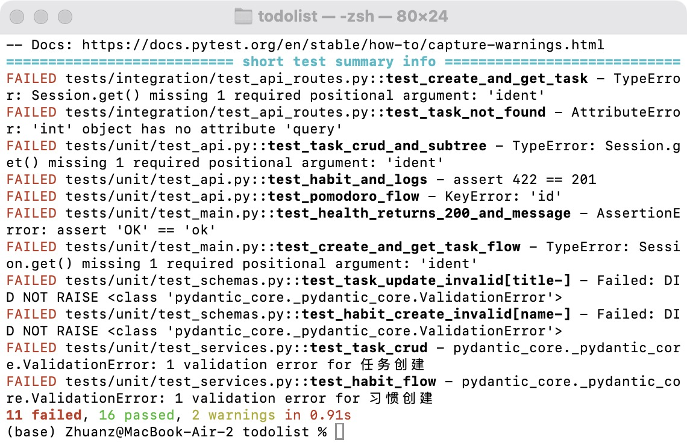
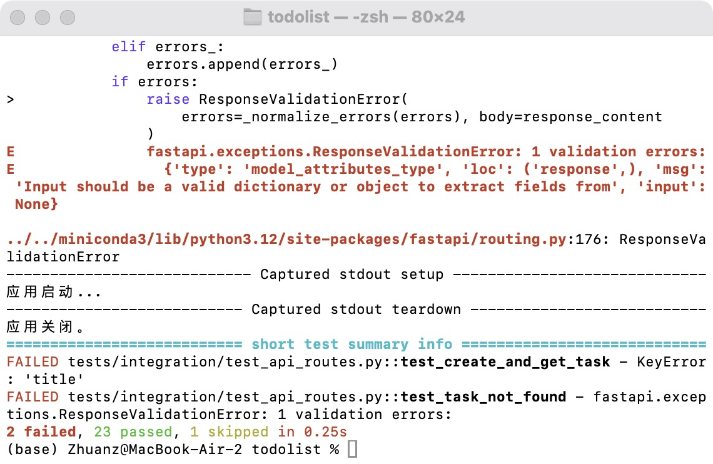
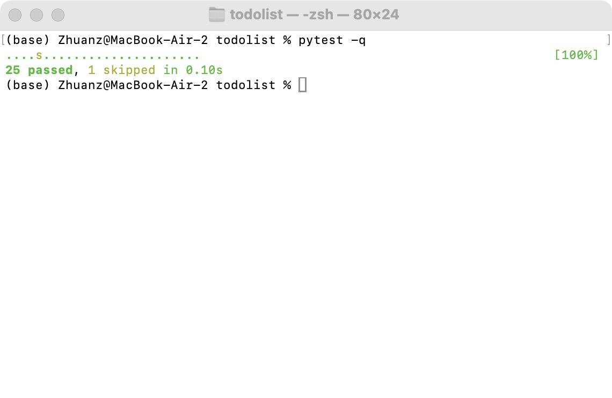

# 待办事项后端API 测试报告

- **项目名称**: to_do_list
- **项目版本**: V1.0
- **测试人员**: 李锡浩 杨晓舒
- **测试日期**: 2025年07月01日

---

## 1. 测试简介

本次测试旨在验证“待办事项后端”项目的核心API功能是否正常工作。主要测试对象包括 **任务管理**、**习惯养成**  二个模块

- **测试工具**: 
  - FastAPI 自动生成的交互式API文档 (`/docs`)
  - ApiFox
- **测试环境**: 本地开发环境 (`http://127.0.0.1:8000`)

---

## 2. Swagger UI功能测试用例与结果

### 2.1. 任务 (Tasks) 模块测试


| 用例ID | 测试功能 | 测试步骤 | 预期结果 | 实际结果 (截图) | 状态 |
| :--- | :--- | :--- | :--- | :--- | :--- |
| **TC-TASK-001** | **成功创建新任务** | 1. 访问 `/docs` 页面，展开 `POST /tasks` 接口。<br>2. 点击 "Try it out"。<br>3. 在请求体中输入: <br> `{ "name": "学习API测试", "description": "尝试" }`<br>4. 点击 "Execute"。 | - 服务器返回 `201 Created` 状态码。<br>- 响应内容中包含刚创建的任务信息，并带有一个唯一的 `id`。 |  | 通过 |
| **TC-TASK-002** | **创建任务失败 (缺少名称)** |  在请求体中输入一个没有 `name` 字段的JSON: <br> `{ "description": "没有名称的任务" }`<br> | - 服务器返回 `422 Unprocessable Entity` 错误状态码。<br>- 响应内容中提示 `name` 字段是必需的。 |  | 通过 |
| **TC-TASK-003** | **获取所有任务列表** | 1. 确保已通过 **TC-TASK-001** 创建了至少一个任务。<br>2. 点击 "Try it out"，然后点击 "Execute"。 | - 服务器返回 `200 OK` 状态码。<br>- 响应内容是一个列表（数组），列表中包含了之前创建的任务。 |  | 通过 |
| **TC-TASK-004** | **更新指定任务** | 1. 记下 **TC-TASK-001** 中创建的任务 `id` (例如 `1`)。<br>2. 在 `task_id` 处填入 `1`。<br>3. 在请求体中输入: <br> `{ "completed": true }`<br>4. 点击 "Execute"。 | - 服务器返回 `200 OK` 状态码。<br>- 响应内容中，该任务的 `completed` 字段变为 `true`。 | | 通过 |
| **TC-TASK-005** | **删除指定任务** | 1. 在 `task_id` 处填入 `1`。<br>2. 点击 "Execute"。 | - 服务器返回 `204 No Content` 状态码。<br>- 此时再次获取任务列表 (**TC-TASK-003**)，该任务已不存在。 | |  通过 |
| **TC-TASK-006** | **搜索指定任务** | 1. 在 `搜索` 处填入 `API`。<br>2. 点击 "Execute"。 |  - 服务器返回 `200 OK` 状态码。<br>- 此时再次获取任务列表 (**TC-TASK-003**)，该任务已不存在。 | |  通过 |
| **TC-TASK-007** | **返回子任务** | 1. 在 `task_id` 处填入 `8`。<br>2. 点击 "Execute"。 |  - 服务器返回 `200 OK` 状态码。<br>- 响应内容是一个列表（数组），列表中包含了之前创建的任务。 | |  通过 |

---

### 2.2. 习惯 (Habits) 模块测试

| 用例ID | 测试功能 | 测试步骤 | 预期结果 | 实际结果 (截图) | 状态 |
| :--- | :--- | :--- | :--- | :--- | :--- |
| **TC-HABIT-001** | **成功创建新习惯** | 1. 访问 `/docs` 页面，展开 `POST /habits` 接口。<br>2. 点击 "Try it out"。<br>3. 在请求体中输入: <br> `{ "name": "每天阅读", "description": "每天阅读30分钟" }`<br>4. 点击 "Execute"。 |  - 服务器返回 `201 Created` 状态码。<br>- 响应内容中包含刚创建的习惯信息，并带有一个 `id`。 |  | 通过 |
| **TC-HABIT-002** | **创建重复习惯** | 1. 在请求体中输入: <br> `{ "name": "每天阅读", "description": "每天阅读30分钟" }`<br>2. 点击 "Execute"。 |  - 服务器返回 `400 Bad Request` 状态码。<br>- 响应内容中提示`创建习惯失败: 习惯 '每天阅读' 已存在。` | | 通过 |
| **TC-HABIT-003** | **获取所有习惯列表** | 1. 确保已通过 **TC-HABIT-001** 创建了至少一个习惯。<br>2. 点击 "Try it out"，然后点击 "Execute"。 | - 服务器返回 `200 OK` 状态码。<br>- 响应内容是一个列表，包含了之前创建的习惯。 |  |  通过 |
| **TC-HABIT-004** | **成功为习惯打卡** | 1. 记下 **TC-HABIT-001** 中创建的习惯 `id` (例如 `2`)。<br>2. 在 `habit_id` 处填入 `3`。<br>3. 请求体可以为空 `{}` 或 `{"date": "2025-07-01T10:20:00Z"}`<br>4. 点击 "Execute"。 | - 服务器返回 `201 Created` 状态码。<br>- 响应内容为 `{"id": 3,"habit_id": 3,"date": "2025-07-01T00:00:00"}`。<br>- 产生一个打卡日志 |  |  通过 |
| **TC-HABIT-005** | **每日只能打卡一次** | 1. 记下 **TC-HABIT-001** 中创建的习惯 `id` (例如 `2`)。<br>2. 在 `habit_id` 处填入 `2`。<br>3. 请求体可以为空 `{}` 或 `{"date": "2025-07-01T10:20:00Z"}`<br>4. 点击 "Execute"。 | - 服务器返回 `409 Conflict` 状态码。<br>- 响应内容为 `{"detail": "创建打卡记录失败: 今日已打卡，请勿重复操作。"}`。<br>- 产生一个打卡日志 |  |  通过 |
| **TC-HABIT-006** | **获取打卡记录** | 1. 记下 **TC-HABIT-001** 中创建的习惯 `id` (例如 `2`)。<br>2. 在 `habit_id` 处填入 `2`。<br>3. 点击 "Execute"。 | - 服务器返回 `200 OK` 状态码。<br>- 响应内容为 `{"[{"id": 1,"habit_id": 2,"date": "2025-07-01T00:00:00"}]"}`。<br>- 产生一个打卡日志 |  |  通过 |
| **TC-HABIT-007** | **获取当前持续打卡天数** | 1. 记下 **TC-HABIT-001** 中创建的习惯 `id` (例如 `2`)。<br>2. 在 `habit_id` 处填入 `2`。<br>3. 点击 "Execute"。 | - 服务器返回 `200 OK` 状态码。<br>- 响应内容为 `1`。<br>- 产生一个打卡日志 |  |  通过 |
---

## 3. Apifox 测试

### 3.1. 任务 (Tasks) 模块测试
##### 3.1.1. 测试流程

##### 3.1.2.功能测试报告
[点击查看任务功能测试文件HTML格式](./assets/tasks-apifox-reports.html)
##### 3.1.3 性能测试报告


### 3.2. 习惯 (Habits) 模块测试
##### 3.2.1. 测试流程

##### 3.2.2. 功能测试报告
[点击查看习惯功能测试文件HTML格式](./assets/habits-apifox-reports.html)
##### 3.2.3. 性能测试报告


## 4 测试用例设计

### 4.1. 任务管理测试
```python
def test_task_crud_and_subtree():
    """测试任务的CRUD操作和子任务功能"""
    # 创建父任务
    response = client.post("/tasks", json={
        "name": "父任务",
        "importance": True,
        "urgent": False
    })
    assert response.status_code == 201
    parent_id = response.json()["id"]

    # 创建子任务
    client.post("/tasks", json={
        "name": "子任务1",
        "parent_id": parent_id
    })

    # 验证子任务数量
    response = client.get(f"/tasks/{parent_id}/children")
    assert len(response.json()) == 1
```

### 4.2 优先级算法测试
```python
def test_priority_calculation():
    """测试任务优先级计算算法"""
    # 重要且紧急的任务
    task1 = Task(importance=True, urgent=True, completed=False)
    assert task1.priority_parameter == 0.9

    # 已完成的任务
    task2 = Task(completed=True)
    assert task2.priority_parameter == 0.0
```
## 5. sonarqube后test优化
提升test覆盖率


新增test单元测试，见文档test_main test_crud等等
通过test后出现的failed逐步降低代码问题





## 6. 测试总结

本次测试覆盖了任务、习惯模块的核心CRUD（创建、读取、更新、删除）功能。

**总体结果**: 所有测试用例均已通过，API功能符合预期。

**发现的问题**:
- 决定将番茄钟的功能完全在前端实现，无需在后端存储数据
