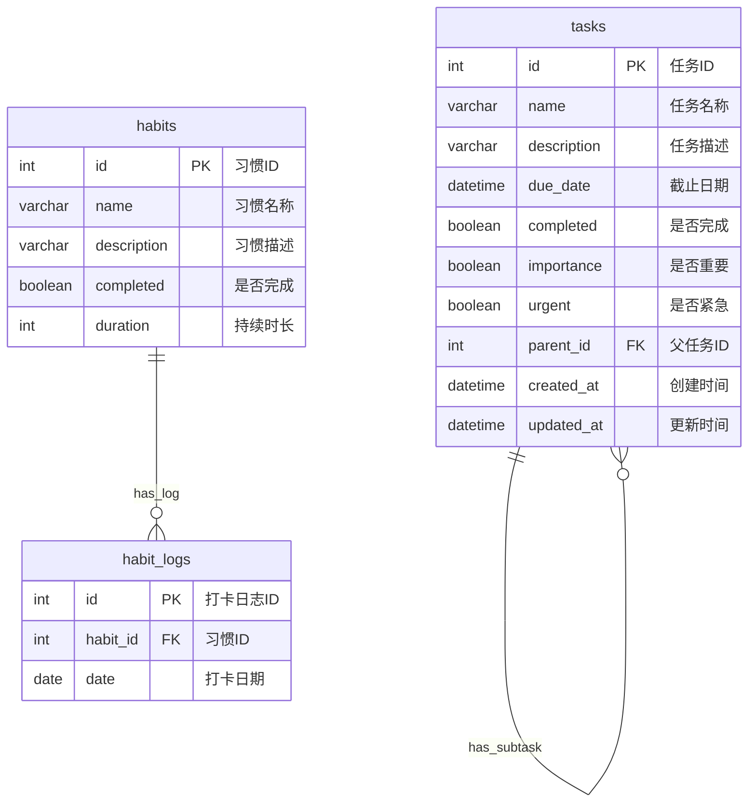

### Todo-List 后端详细设计文档

**文档版本：** V1.0  
**编写人：** 李锡浩  
**编写日期：** 2025年07月04日  
**最后修订日期：** 2025年07月04日  


**目录**

- [Todo-List 后端详细设计文档](#todo-list-后端详细设计文档)
- [1. 引言](#1-引言)
  - [1.1. 文档目的](#11-文档目的)
  - [1.2. 范围](#12-范围)
  - [1.3. 读者对象](#13-读者对象)
  - [1.4. 术语与缩略语](#14-术语与缩略语)
- [2. 系统概述](#2-系统概述)
  - [2.1. 系统功能回顾](#21-系统功能回顾)
  - [2.2. 整体架构回顾](#22-整体架构回顾)
- [3. 模块详细设计](#3-模块详细设计)
  - [3.1. 任务模块详细设计](#31-任务模块详细设计)
    - [3.1.1. 模块功能与职责](#311-模块功能与职责)
    - [3.1.2. 关键组件设计](#312-关键组件设计)
      - [3.1.2.1. TaskService (业务逻辑)](#3121-taskservice-业务逻辑)
      - [3.1.2.2. Task (数据模型)](#3122-task-数据模型)
  - [3.2. 习惯模块详细设计](#32-习惯模块详细设计)
    - [3.2.1. 模块功能与职责](#321-模块功能与职责)
    - [3.2.2. 关键组件设计](#322-关键组件设计)
      - [3.2.2.1. HabitService (业务逻辑)](#3221-habitservice-业务逻辑)
      - [3.2.2.2. Habit 和 HabitLog (数据模型)](#3222-habit-和-habitlog-数据模型)
- [4. 数据库详细设计](#4-数据库详细设计)
  - [4.1. 逻辑数据模型 (ERD)](#41-逻辑数据模型-erd)
  - [4.2. 物理数据模型 (DDL)](#42-物理数据模型-ddl)
- [5. 安全性考虑](#5-安全性考虑)
- [6. 日志与监控](#6-日志与监控)
- [7. 部署与环境](#7-部署与环境)


---

**正文**

### 1. 引言

#### 1.1. 文档目的
本文档旨在对 Todo-List 后端系统进行详细设计，明确各个模块的功能、内部实现逻辑、数据结构以及数据库交互方式。它将作为开发和测试的参考。

#### 1.2. 范围
本设计文档涵盖 Todo-List 后端所有核心功能，包括任务管理和习惯打卡功能。

#### 1.3. 读者对象
* 开发人员
* 测试人员

#### 1.4. 术语与缩略语
| 术语/缩略语 | 解释 |
| :---------- | :--------------------------------- |
| FastAPI     | Python Web框架 |
| SQLAlchemy  | Python ORM 框架，用于数据库操作 |
| Pydantic    | Python 数据校验和序列化库 |
| ORM         | 对象关系映射，将数据库表映射为Python对象 |
| DDL         | 数据定义语言，用于创建数据库结构 |
| CRUD        | 创建 (Create)、读取 (Read)、更新 (Update)、删除 (Delete) |

### 2. 系统概述

#### 2.1. 系统功能回顾
本系统提供以下核心功能：
* **任务管理：** 创建、查询 (按状态、按名称搜索、按父子关系)、更新、删除任务。任务可设置重要性、紧急程度、截止日期，并支持父子任务关联。
* **习惯管理：** 创建、查询所有习惯、为习惯打卡、查询习惯打卡记录、计算持续打卡天数、删除习惯。

#### 2.2. 整体架构回顾
系统采用 FastAPI 框架构建 RESTful API，使用 SQLAlchemy 作为 ORM 进行数据库操作。整体分层清晰，包括：
* **Router (路由层):** 定义API接口和HTTP方法，接收请求，调用服务层.
* **Service (服务层):** 封装业务逻辑，协调 CRUD 层和数据模型.
* **CRUD (数据操作层):** 封装直接的数据库增删改查操作.
* **Models (数据模型层):** 定义 SQLAlchemy 映射的数据库表结构和业务逻辑（如任务优先级计算）.
* **Schemas (Pydantic 模型层):** 定义请求和响应的数据结构，进行数据校验.
* **DB (数据库配置层):** 负责数据库连接和会话管理.

### 3. 模块详细设计

#### 3.1. 任务模块详细设计

##### 3.1.1. 模块功能与职责
* **功能：** 实现任务的完整生命周期管理。
* **职责：** 负责任务的创建、读取（单个、列表、子任务、搜索）、更新和删除操作，并处理任务的优先级计算逻辑.

##### 3.1.2. 关键组件设计

###### 3.1.2.1. `TaskService` (业务逻辑)
* **职责：** 协调 `crud` 模块和 `schemas` 模块，处理任务相关的业务规则.
* **主要方法：**
    * `create_task(db, task_data)`: 创建新任务，校验父任务ID是否存在，处理 `parent_id` 为 0 的情况.
    * `get_task(db, task_id)`: 根据ID获取单个任务，若不存在则抛出异常.
    * `get_all_tasks(db, status, sort_by)`: 获取任务列表，支持按完成状态过滤，按ID、截止日期 (ddl) 或优先级排序.
    * `update_task(db, task_id, update_data)`: 更新任务，校验父任务ID，防止自循环引用.
    * `delete_task(db, task_id)`: 删除任务.
    * `get_subtasks(db, parent_id)`: 获取指定任务的直接子任务.
    * `search_tasks(db, query)`: 根据名称搜索任务.
* **依赖：** `crud` 模块 (`crud.py`)，`schemas` 模块 (`schemas.py`)。

###### 3.1.2.2. `Task` (数据模型)
* **职责：** 定义 `tasks` 数据库表的结构，以及任务的业务属性和行为.
* **关键属性：**
    * `id` (int): 主键.
    * `name` (str): 任务名称.
    * `description` (str | None): 任务描述.
    * `due_date` (datetime | None): 截止日期.
    * `completed` (bool): 是否完成.
    * `importance` (bool): 是否重要.
    * `urgent` (bool): 是否紧急.
    * `parent_id` (int | None): 父任务ID，支持层级任务.
    * `created_at` (datetime), `updated_at` (datetime): 创建和更新时间.
* **关键方法：**
    * `priority_parameter` (property): 计算任务的优先级，结合重要性、紧急程度和截止日期。已完成任务优先级为 0，超期任务优先级最高。
* **关系：**
    * `parent`: 多对一关系，指向父任务。
    * `subtasks`: 一对多关系，指向子任务列表，配置 `cascade="all, delete-orphan"` 实现级联删除。

#### 3.2. 习惯模块详细设计

##### 3.2.1. 模块功能与职责
* **功能：** 实现习惯的创建、查询、删除以及习惯打卡记录的管理.
* **职责：** 负责习惯的增删查改，以及打卡记录的创建和连续打卡天数的计算.

##### 3.2.2. 关键组件设计

###### 3.2.2.1. `HabitService` (业务逻辑)
* **职责：** 协调 `crud` 模块和 `schemas` 模块，处理习惯和打卡相关的业务规则.
* **主要方法：**
    * `create_habit(db, habit_data)`: 创建新习惯，检查名称是否重复.
    * `get_all_habits(db)`: 获取所有习惯，并加载其打卡记录.
    * `create_habit_log(db, habit_id, log_data)`: 为习惯创建打卡记录，检查习惯是否存在和是否重复打卡.
    * `get_habit_logs(db, habit_id)`: 获取指定习惯的所有打卡记录.
    * `get_habit_streak(db, habit_id)`: 计算指定习惯的当前持续打卡天数.
    * `delete_habit(db, habit_id)`: 删除习惯.
* **依赖：** `crud` 模块 (`crud.py`)，`schemas` 模块 (`schemas.py`)。

###### 3.2.2.2. `Habit` 和 `HabitLog` (数据模型)
* **职责：** 定义 `habits` 和 `habit_logs` 数据库表的结构.
* **`Habit` 关键属性：**
    * `id` (int): 主键.
    * `name` (str): 习惯名称，唯一.
    * `description` (str | None): 习惯描述.
    * `completed` (bool): 习惯是否完成 (此字段在当前逻辑中未充分使用，但存在).
    * `duration` (int): 习惯持续时间 (当前逻辑中未充分使用).
* **`Habit` 关系：**
    * `logs`: 一对多关系，指向 `HabitLog` 列表，配置 `cascade="all, delete-orphan"` 实现级联删除.
* **`HabitLog` 关键属性：**
    * `id` (int): 主键.
    * `habit_id` (int): 外键，关联 `habits` 表.
    * `date` (date): 打卡日期，与 `habit_id` 构成联合唯一约束，确保每日一打卡.
* **`HabitLog` 关系：**
    * `habit`: 多对一关系，指向所属习惯.

### 4. 数据库详细设计

#### 4.1. 逻辑数据模型 (ERD)



#### 4.2. 物理数据模型 (DDL)
```SQL
-- tasks 表
CREATE TABLE tasks (
    id INTEGER NOT NULL,
    name VARCHAR(255) NOT NULL,
    description VARCHAR,
    due_date DATETIME,
    completed BOOLEAN NOT NULL,
    importance BOOLEAN NOT NULL,
    urgent BOOLEAN NOT NULL,
    parent_id INTEGER,
    created_at DATETIME NOT NULL,
    updated_at DATETIME NOT NULL,
    PRIMARY KEY (id),
    FOREIGN KEY(parent_id) REFERENCES tasks (id)
);
CREATE INDEX ix_tasks_id ON tasks (id);
CREATE INDEX ix_tasks_name ON tasks (name);

-- habits 表
CREATE TABLE habits (
    id INTEGER NOT NULL,
    name VARCHAR(128) NOT NULL UNIQUE,
    description VARCHAR,
    completed BOOLEAN NOT NULL,
    duration INTEGER NOT NULL,
    PRIMARY KEY (id)
);
CREATE INDEX ix_habits_id ON habits (id);

-- habit_logs 表
CREATE TABLE habit_logs (
    id INTEGER NOT NULL,
    habit_id INTEGER NOT NULL,
    date DATE NOT NULL,
    PRIMARY KEY (id),
    UNIQUE (habit_id, date),
    FOREIGN KEY(habit_id) REFERENCES habits (id)
);
```

### 5. 安全性考虑
- CORS 配置： 允许所有来源 (allow_origins=["*"]) 进行跨域请求，在生产环境中应限制为特定的前端域名。
- 输入校验： 使用 Pydantic 进行请求参数的自动校验，确保数据格式和类型正确.

### 6. 日志与监控
- 日志： FastAPI 框架本身会输出请求日志。在 main.py 中有简单的启动日志。
- 健康检查： 提供 /health 接口用于简单的应用状态检查。

### 7. 部署与环境
- 数据库： 默认使用 SQLite 数据库文件 (./data/todo.db)，方便本地开发和演示。
- 启动方式： 使用 uvicorn.run(app, host="0.0.0.0", port=8000) 启动应用，监听所有网络接口。