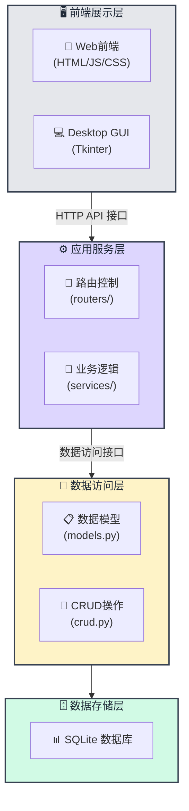
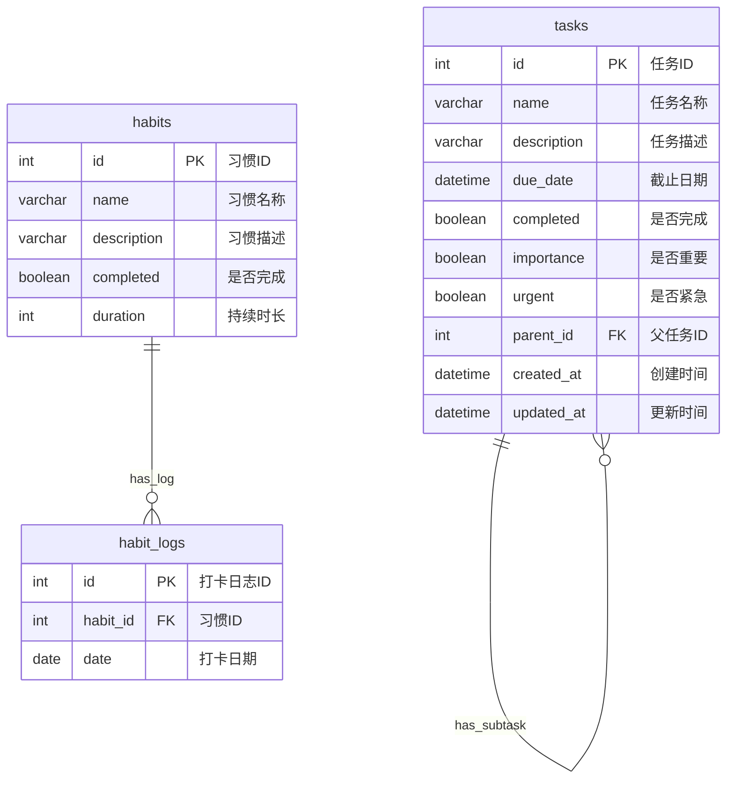
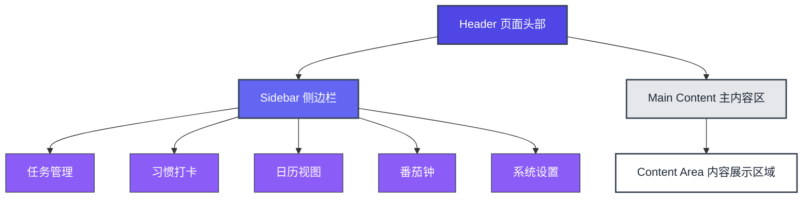
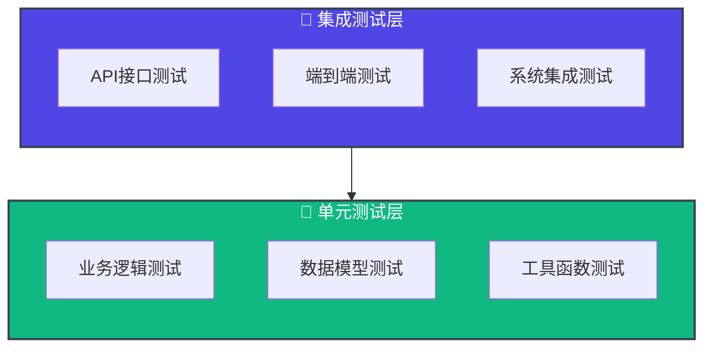

# To-Do List 系统详细设计文档

**目录**

- [To-Do List 系统详细设计文档](#to-do-list-系统详细设计文档)
  - [📋 文档信息](#-文档信息)
  - [🎯 系统概述](#-系统概述)
    - [1.1 项目背景](#11-项目背景)
    - [1.2 设计目标](#12-设计目标)
    - [1.3 核心功能](#13-核心功能)
  - [🏗️ 系统架构设计](#️-系统架构设计)
    - [2.1 整体架构](#21-整体架构)
    - [2.2 技术架构](#22-技术架构)
  - [📊 数据库设计](#-数据库设计)
    - [3.1 数据库图](#31-数据库图)
    - [3.2 数据表详细设计](#32-数据表详细设计)
      - [3.2.1 Task（任务表）](#321-task任务表)
      - [3.2.2 Habit（习惯表）](#322-habit习惯表)
      - [3.2.3 HabitLog（习惯日志表）](#323-habitlog习惯日志表)
  - [🔧 API接口设计](#-api接口设计)
    - [4.1 接口规范](#41-接口规范)
      - [4.1.1 通用规范](#411-通用规范)
      - [4.1.2 响应状态码](#412-响应状态码)
    - [4.2 任务管理API](#42-任务管理api)
      - [4.2.1 创建任务](#421-创建任务)
      - [4.2.2 获取任务列表](#422-获取任务列表)
      - [4.2.3 更新任务](#423-更新任务)
      - [4.2.4 删除任务](#424-删除任务)
      - [4.2.5 搜索任务](#425-搜索任务)
      - [4.2.6 获取子任务](#426-获取子任务)
    - [4.3 习惯管理API](#43-习惯管理api)
      - [4.3.1 创建习惯](#431-创建习惯)
      - [4.3.2 习惯打卡](#432-习惯打卡)
      - [4.3.3 获取打卡记录](#433-获取打卡记录)
  - [💼 业务逻辑设计](#-业务逻辑设计)
    - [5.1 任务优先级算法](#51-任务优先级算法)
      - [5.1.1 算法原理](#511-算法原理)
      - [5.1.2 优先级矩阵](#512-优先级矩阵)
    - [5.2 习惯管理逻辑](#52-习惯管理逻辑)
      - [5.2.1 打卡规则](#521-打卡规则)
      - [5.2.2 习惯统计](#522-习惯统计)
    - [5.3 数据验证逻辑](#53-数据验证逻辑)
      - [5.3.1 任务验证](#531-任务验证)
      - [5.3.2 验证规则](#532-验证规则)
  - [🎨 前端设计](#-前端设计)
    - [6.1 界面设计](#61-界面设计)
      - [6.1.1 设计理念](#611-设计理念)
    - [6.2 页面结构](#62-页面结构)
      - [6.2.1 布局设计](#621-布局设计)
      - [6.2.2 组件设计](#622-组件设计)
    - [6.3 交互设计](#63-交互设计)
      - [6.3.1 任务操作流程](#631-任务操作流程)
      - [6.3.2 习惯打卡流程](#632-习惯打卡流程)
  - [🔐 安全设计](#-安全设计)
    - [7.1 数据安全](#71-数据安全)
      - [7.1.1 输入验证](#711-输入验证)
      - [7.1.2 数据完整性](#712-数据完整性)
  - [📈 性能优化](#-性能优化)
    - [8.1 数据库优化](#81-数据库优化)
      - [8.1.1 索引策略](#811-索引策略)
      - [8.1.2 查询优化](#812-查询优化)
  - [🧪 测试设计](#-测试设计)
    - [9.1 测试策略](#91-测试策略)
      - [9.1.1 测试分层](#911-测试分层)
    - [9.2 测试用例设计](#92-测试用例设计)
      - [9.2.1 任务管理测试](#921-任务管理测试)
      - [9.2.2 优先级算法测试](#922-优先级算法测试)
      - [9.2.3 Apifox和swagger ui的功能性能测试](#923-apifox和swagger-ui的功能性能测试)
  - [🚀 部署方案](#-部署方案)
    - [10.1 开发环境](#101-开发环境)
      - [10.1.1 环境要求](#1011-环境要求)
      - [10.1.2 启动步骤](#1012-启动步骤)
  - [📞 联系信息](#-联系信息)


## 📋 文档信息

| 项目信息 | 详情 |
|---------|------|
| **项目名称** | 高效生活 - TodoList 管理系统 |
| **版本号** | v1.0.0 |
| **文档版本** | v1.0 |
| **创建日期** | 2025年7月4日 |
| **技术栈** | FastAPI + SQLAlchemy + HTML/JavaScript/Tkinter |

---

## 🎯 系统概述

### 1.1 项目背景
本项目旨在开发一个现代化的个人效率管理系统，集成任务管理、习惯打卡、番茄钟和日历功能，帮助用户提高工作效率和生活质量。

### 1.2 设计目标
- **易用性**：简洁直观的用户界面
- **高效性**：智能优先级算法，优化任务管理
- **扩展性**：模块化设计，便于功能扩展
- **稳定性**：完善的错误处理和数据持久化

### 1.3 核心功能
1. **任务管理**：增删改查、优先级计算、层级结构
2. **习惯打卡**：习惯管理、日志记录、数据统计
3. **番茄钟**：专注时间管理、工作统计
4. **日历视图**：任务与日期关联、可视化展示

---

## 🏗️ 系统架构设计

### 2.1 整体架构



### 2.2 技术架构

| 层级 | 技术选型 | 说明 |
|------|----------|------|
| **前端2.0** | HTML + CSS + JavaScript | 响应式Web界面 |
| **GUI** | Python Tkinter | 桌面应用界面 |
| **后端** | FastAPI + Python 3.8+ | 高性能异步Web框架 |
| **ORM** | SQLAlchemy 2.0 | 现代化数据库ORM |
| **数据库** | SQLite | 轻量级嵌入式数据库 |
| **验证** | Pydantic v2 | 数据验证和序列化 |

---

## 📊 数据库设计

### 3.1 数据库图



### 3.2 数据表详细设计

#### 3.2.1 Task（任务表）

| 字段名 | 类型 | 约束 | 说明 |
|--------|------|------|------|
| id | INTEGER | PRIMARY KEY | 任务唯一标识 |
| name | VARCHAR(255) | NOT NULL, INDEX | 任务名称 |
| description | TEXT | NULLABLE | 任务描述 |
| due_date | DATETIME | NULLABLE | 截止日期 |
| completed | BOOLEAN | NOT NULL, DEFAULT FALSE | 完成状态 |
| importance | BOOLEAN | NOT NULL, DEFAULT FALSE | 重要标识 |
| urgent | BOOLEAN | NOT NULL, DEFAULT FALSE | 紧急标识 |
| parent_id | INTEGER | FOREIGN KEY, NULLABLE | 父任务ID |
| created_at | DATETIME | NOT NULL | 创建时间 |
| updated_at | DATETIME | NOT NULL | 更新时间 |

**关系设计**：
- 自引用关系：支持父子任务结构
- 级联删除：删除父任务时，子任务一并删除

#### 3.2.2 Habit（习惯表）

| 字段名 | 类型 | 约束 | 说明 |
|--------|------|------|------|
| id | INTEGER | PRIMARY KEY | 习惯唯一标识 |
| name | VARCHAR(128) | NOT NULL, UNIQUE | 习惯名称 |
| description | TEXT | NULLABLE | 习惯描述 |
| completed | BOOLEAN | NOT NULL, DEFAULT FALSE | 当日完成状态 |
| duration | INTEGER | NOT NULL, DEFAULT 0 | 持续天数 |

#### 3.2.3 HabitLog（习惯日志表）

| 字段名 | 类型 | 约束 | 说明 |
|--------|------|------|------|
| id | INTEGER | PRIMARY KEY | 日志唯一标识 |
| habit_id | INTEGER | FOREIGN KEY, NOT NULL | 关联习惯ID |
| date | DATE | NOT NULL, DEFAULT TODAY | 打卡日期 |

**约束设计**：
- 唯一性约束：`(habit_id, date)` 确保每日只能打卡一次

---

## 🔧 API接口设计

### 4.1 接口规范

#### 4.1.1 通用规范
- **协议**：HTTP/HTTPS
- **数据格式**：JSON
- **字符编码**：UTF-8
- **API版本**：v1
- **Base URL**：`http://127.0.0.1:8000`

#### 4.1.2 响应状态码
| 状态码 | 说明 |
|--------|------|
| 200 | 请求成功 |
| 201 | 创建成功 |
| 204 | 删除成功 |
| 400 | 请求参数错误 |
| 404 | 资源不存在 |
| 500 | 服务器内部错误 |

### 4.2 任务管理API

#### 4.2.1 创建任务
```http
POST /tasks
Content-Type: application/json

{
    "name": "完成项目设计文档",
    "description": "编写详细的系统设计文档",
    "due_date": "2025-07-05T18:00:00",
    "importance": true,
    "urgent": false,
    "parent_id": null
}
```

**响应示例**：
```json
{
    "id": 1,
    "name": "完成项目设计文档",
    "description": "编写详细的系统设计文档",
    "due_date": "2025-07-05T18:00:00",
    "completed": false,
    "importance": true,
    "urgent": false,
    "parent_id": 0,
    "created_at": "2025-07-04T10:00:00",
    "updated_at": "2025-07-04T10:00:00"
}
```

#### 4.2.2 获取任务列表
```http
GET /tasks?status=pending&sort_by=priority
```

**查询参数**：
- `status`: `all`|`pending`|`completed`
- `sort_by`: `priority`|`id`|`ddl`

#### 4.2.3 更新任务
```http
PATCH /tasks/{task_id}
Content-Type: application/json

{
    "completed": true
}
```

#### 4.2.4 删除任务
```http
DELETE /tasks/{task_id}
```

#### 4.2.5 搜索任务
```http
GET /tasks/search?q=设计
```

#### 4.2.6 获取子任务
```http
GET /tasks/{task_id}/children
```

### 4.3 习惯管理API

#### 4.3.1 创建习惯
```http
POST /habits
Content-Type: application/json

{
    "name": "早起锻炼",
    "description": "每天早上6点起床锻炼30分钟",
    "duration": 21
}
```

#### 4.3.2 习惯打卡
```http
POST /habits/{habit_id}/logs
Content-Type: application/json

{}
```

#### 4.3.3 获取打卡记录
```http
GET /habits/{habit_id}/logs
```

---

## 💼 业务逻辑设计

### 5.1 任务优先级算法

#### 5.1.1 算法原理
任务优先级基于三个维度计算：重要性、紧急性、截止日期

```python
def priority_parameter(self) -> float:
    """
    计算任务优先级 (0~1)
    """
    if self.completed:
        return 0.0

    # 权重配置
    importance_weight = 0.45  # 重要性权重
    urgent_weight = 0.45      # 紧急性权重
    due_date_weight = 0.10    # 截止日期权重

    # 基础值计算
    importance_value = 1 if self.importance else 0
    urgent_value = 1 if self.urgent else 0

    # 截止日期处理
    if self.due_date:
        days_to_due = (self.due_date - datetime.now()).days
        if days_to_due < 0:
            due_date_value = 1.0  # 已超期
        else:
            due_date_value = 1 / (days_to_due + 1)
    else:
        due_date_value = 0.0  # 无截止日期

    return (
        importance_value * importance_weight +
        urgent_value * urgent_weight +
        due_date_value * due_date_weight
    )
```

#### 5.1.2 优先级矩阵

| 重要性 | 紧急性 | 基础得分 | 描述 |
|--------|--------|----------|------|
| 是 | 是 | 0.90 | 重要且紧急，优先处理 |
| 是 | 否 | 0.45 | 重要不紧急，计划安排 |
| 否 | 是 | 0.45 | 不重要但紧急，快速处理 |
| 否 | 否 | 0.00 | 不重要不紧急，延后处理 |

### 5.2 习惯管理逻辑

#### 5.2.1 打卡规则
- 每个习惯每天只能打卡一次
- 使用 `(habit_id, date)` 唯一约束确保数据完整性
- 打卡时自动记录当前日期

#### 5.2.2 习惯统计
- **连续天数**：计算连续打卡的天数
- **完成率**：计算指定时间段内的完成率
- **趋势分析**：展示习惯完成的时间趋势

### 5.3 数据验证逻辑

#### 5.3.1 任务验证
```python
class TaskCreate(BaseModel):
    name: str = Field(..., max_length=255)
    description: str | None = None
    due_date: datetime | None = None
    importance: bool = False
    urgent: bool = False
    parent_id: int | None = None
```

#### 5.3.2 验证规则
- **任务名称**：必填，最大长度255字符
- **截止日期**：可选，必须是有效的日期时间格式
- **父任务**：可选，必须是已存在的任务ID

---

## 🎨 前端设计

### 6.1 界面设计

#### 6.1.1 设计理念
- **简洁性**：界面简洁，操作直观
- **一致性**：统一的视觉语言和交互模式
- **响应性**：适配不同屏幕尺寸
- **可访问性**：支持键盘导航和屏幕阅读器


### 6.2 页面结构

#### 6.2.1 布局设计


#### 6.2.2 组件设计

**任务组件**：
```html
<div class="task-item">
    <input type="checkbox" class="task-checkbox">
    <div class="task-content">
        <h3 class="task-title">任务名称</h3>
        <p class="task-description">任务描述</p>
        <div class="task-meta">
            <span class="task-due-date">截止日期</span>
            <span class="task-priority">优先级</span>
        </div>
    </div>
    <div class="task-actions">
        <button class="edit-btn">编辑</button>
        <button class="delete-btn">删除</button>
    </div>
</div>
```

### 6.3 交互设计

#### 6.3.1 任务操作流程
1. **创建任务**：点击"创建任务" → 填写表单 → 提交保存
2. **完成任务**：点击复选框 → 任务状态更新 → 视觉反馈
3. **编辑任务**：点击编辑按钮 → 弹出编辑框 → 修改保存
4. **删除任务**：点击删除按钮 → 确认对话框 → 删除操作

#### 6.3.2 习惯打卡流程
1. **查看习惯**：进入习惯页面 → 显示习惯列表
2. **完成打卡**：点击打卡按钮 → 记录打卡 → 更新状态

---

## 🔐 安全设计

### 7.1 数据安全

#### 7.1.1 输入验证
- 使用 Pydantic 进行数据验证
- SQL注入防护：使用 SQLAlchemy ORM

#### 7.1.2 数据完整性
- 数据库约束：外键约束、唯一性约束
- 事务处理：确保数据一致性
- 错误处理：异常捕获和错误回滚


---

## 📈 性能优化

### 8.1 数据库优化

#### 8.1.1 索引策略
```sql
-- 任务表索引
CREATE INDEX idx_task_name ON tasks(name);
CREATE INDEX idx_task_completed ON tasks(completed);
CREATE INDEX idx_task_due_date ON tasks(due_date);
CREATE INDEX idx_task_parent_id ON tasks(parent_id);

-- 习惯表索引
CREATE INDEX idx_habit_name ON habits(name);
CREATE INDEX idx_habitlog_date ON habit_logs(date);
```

#### 8.1.2 查询优化
- 避免 N+1 查询：使用 SQLAlchemy 的 `joinedload`
- 分页查询：大数据集使用分页
- 查询缓存：频繁查询结果缓存

---

## 🧪 测试设计

### 9.1 测试策略

#### 9.1.1 测试分层




### 9.2 测试用例设计

#### 9.2.1 任务管理测试
```python
def test_task_crud_and_subtree():
    """测试任务的CRUD操作和子任务功能"""
    # 创建父任务
    response = client.post("/tasks", json={
        "name": "父任务",
        "importance": True,
        "urgent": False
    })
    assert response.status_code == 201
    parent_id = response.json()["id"]
    
    # 创建子任务
    client.post("/tasks", json={
        "name": "子任务1",
        "parent_id": parent_id
    })
    
    # 验证子任务数量
    response = client.get(f"/tasks/{parent_id}/children")
    assert len(response.json()) == 1
```

#### 9.2.2 优先级算法测试
```python
def test_priority_calculation():
    """测试任务优先级计算算法"""
    # 重要且紧急的任务
    task1 = Task(importance=True, urgent=True, completed=False)
    assert task1.priority_parameter == 0.9
    
    # 已完成的任务
    task2 = Task(completed=True)
    assert task2.priority_parameter == 0.0
```

#### 9.2.3 Apifox和swagger ui的功能性能测试
具体见本项目测试文档

---

## 🚀 部署方案

### 10.1 开发环境

#### 10.1.1 环境要求
- Python 3.8+
- Node.js 16+ (前端开发)
- SQLite 3.x

#### 10.1.2 启动步骤
```bash
# 1. 创建虚拟环境
python -m venv .venv
source .venv/bin/activate  # Windows: .venv\Scripts\activate

# 2. 安装依赖
pip install -r requirements-dev.txt

# 3. 启动开发服务器
uvicorn src.app.main:app --reload

# 4. 启动桌面应用
python run.py
```

---


## 📞 联系信息

**项目团队**：TodoList 开发团队  
**技术负责人**：牛茂润 杨晓舒 李锡浩 严晨 顾晨昊  
**项目经理**：牛茂润  
**文档维护**：严晨 李锡浩  
**最后更新**：2025年7月4日

---

